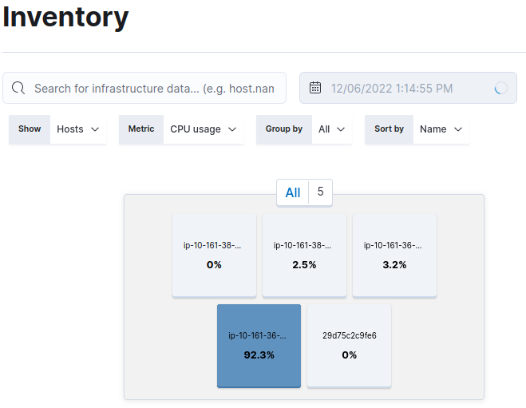

# Argo Workflows Settings

This document describes the settings that can be applied to Argo Workflows in general, to manage the performance of the workflows, and the settings that are currently applied. If you would like help, talk to the Topo Data Engineering team.

- [Introduction to the Argo Workflows Environment](#introduction-to-the-argo-workflows-environment)
- [Workflow Structure and General Settings](#workflow-structure-and-general-settings)
  - [Inputs and Outputs](#inputs-and-outputs)
  - [Container Images](#container-images)
  - [Container Environment Variables](#container-environment-variables)
- [Workflow Performance Settings](#workflow-performance-settings)
  - [Configuration Options for Optimising Performance](#configuration-options-for-optimising-performance)
    - [1. EC2 resources requested by workflow tasks](#1-ec2-resources-requested-by-workflow-tasks)
    - [2. Running tasks in parallel on multiple pods](#2-running-tasks-in-parallel-on-multiple-pods)
    - [3. Performance optimisations in the code itself (concurrency)](#3-performance-optimisations-in-the-code-itself-concurrency)
  - [Workflow example utilising parallelism, batching and concurrency](#workflow-example-utilising-parallelism-batching-and-concurrency)
- [Approaches for Improving Workflow Performance](#approaches-for-improving-workflow-performance)
  - [How do you know if your workflows are not running optimally?](#how-do-you-know-if-your-workflows-are-not-running-optimally)
  - [Parallelism](#parallelism)
  - [Examining Resource Usage](#examining-resource-usage)
  - [Where to Start?](#where-to-start)
- [Additional Resources](#additional-resources)
  - [LINZ Argo Workflows Repositories](#linz-argo-workflows-repositories)

## Introduction to the Argo Workflows Environment

Argo Workflows allows users to define a series of tasks to be carried out, where each task specifies code to be run, often in parallel. Tasks have inputs and outputs which are managed by Argo so that information can be passed along a workflow between tasks.

Each task runs inside a container, which runs on an Argo “pod”. The Topo Argo Workflows is installed on the AWS Elastic Kubernetes Service (EKS), and pods run on AWS Elastic Computer Cloud (EC2) Spot Instances (providing the best value for money). Multiple pods can run on each EC2 instance at the same time. Output “artifacts” (e.g. processed files, configuration to be used later) and logs are stored in the S3 bucket: `linz-workflow-artifacts`.

Requesting EC2 instances is done by the Karpenter Autoscaler, based on the resource requirements of the workflow.

Workflows that need to be run multiple times are stored as WorkflowTemplates.

Workflows can be run from the Argo UI or the command line.

## Workflow Structure and General Settings

Workflows are written in YAML and follow a nested structure, first defining settings that apply to the whole workflow and the initial workflow parameters (specified when submitting a workflow), then which tasks to run. Settings for individual tasks within the workflow are then specified:

- inputs
- outputs
- task dependencies (if a task relies on other tasks to complete before it can begin)
- container image to run
- container environment variables
- the command and arguments each task should run in the container
- EC2 instance requirements

For information about how to write a workflow, see the [Argo Workflows Training Documentation](https://argoproj.github.io/argo-workflows/training/).

### Inputs and Outputs

These can be passed between different tasks in a workflow. The workflow parameters specified on workflow submission can also be used as inputs. There are different types of inputs and outputs:

**Parameters:** these are held within Argo Workflows and passed between tasks as inputs and outputs. There is a maximum size of 256kB.

**Artifacts:** these are stored in the S3 artifacts bucket when a container task ends and can be used for larger inputs and outputs.

**“S3 Actions”:** these are not part of Argo Workflows but are used in some of the Argo Tasks container commands as a way to pass larger information between tasks in a workflow more efficiently.

### Container Images

The Argo Workflows make use of the following Toitū Te Whenua containers:

| **Container**                                                                    | **Repo**                                                  | **Purpose**                                                                       |
| -------------------------------------------------------------------------------- | --------------------------------------------------------- | --------------------------------------------------------------------------------- |
| [topo-imagery](https://github.com/linz/topo-imagery/pkgs/container/topo-imagery) | https://github.com/linz/topo-imagery                      | Python scripts that need to use the GDAL library and geospatial Python libraries. |
| [argo-tasks](https://github.com/linz/argo-tasks/pkgs/container/argo-tasks)       | https://github.com/linz/argo-tasks                        | Reusable utility tasks written in TypeScript.                                     |
| [basemaps-cli](https://github.com/linz/basemaps/pkgs/container/basemaps%2Fcli)   | https://github.com/linz/basemaps/tree/master/packages/cli | Controls Basemaps configuration.                                                  |

### Container Environment Variables

Environment variables can be set in the containers as below, which is setting the location of the AWS permissions configuration file:

```yaml
container:
  image: 019359803926.dkr.ecr.ap-southeast-2.amazonaws.com/argo-tasks:latest
  command: [node, /app/index.js]
  env:
    - name: AWS_ROLE_CONFIG_PATH
      value: s3://linz-bucket-config/config.json
  args: ['stac-validate', '--recursive', '{{inputs.parameters.location}}flat/collection.json']
```

## Workflow Performance Settings

There are a few ways that tasks can be optimised to run faster, or to make better use of resources. Usually these will be set after some experimentation with settings to find a good combination. Tasks may have different characteristics and requirements, so what works well for one workflow task may not work for another.

The ideal is to have as many tasks as possible running at the same time, loading the resources available without overloading them. This can require some trial and error.

There are two main ways to improve performance; horizontal scaling (running more tasks at once) and vertical scaling (assigning more resources to the tasks).

### Configuration Options for Optimising Performance

Performance can be tuned at the following levels:

1. EC2 resources requested by workflow tasks.
2. The number of task pods that will run at a time (parallelism).
3. In the code itself (concurrency).

#### 1. EC2 resources requested by workflow tasks

These are the EC2 Instance resources requested by the workflow to carry out a task. The Karpenter Autoscaler will base the number and size of EC2 instances requested on a combination of the resources requested and the number of task pods to run in parallel.

**EC2 Instance Sizing**

The EC2 instance types Karpenter can choose from are limited to the instance types specified when the Kubernetes cluster was configured. The largest instance size currently allowed by our configuration is `12xlarge`, which has these specs:

- vCPU: 48
- Memory: 96GiB
- Network bandwidth: 20Gbps
- There is also 100GiB of local storage available.

This configuration can be changed if larger instance types are required in future workflows.

Two example workflow tasks requesting specific resources (memory and CPU) from the [topo-workflows GitHub repo standardising workflow](https://github.com/linz/topo-workflows/blob/master/workflows/imagery/standardising.yaml):

```yaml
- name: standardise-validate
  retryStrategy:
    limit: '2'
  nodeSelector:
    karpenter.sh/capacity-type: 'spot'
  inputs:
    parameters:
      - name: file
      - name: collection-id
  container:
    image: 019359803926.dkr.ecr.ap-southeast-2.amazonaws.com/topo-imagery:latest
    resources:
      requests:
        memory: 7.8Gi
        cpu: 15000m
        ephemeral-storage: 3Gi
    volumeMounts:
      - name: ephemeral
        mountPath: '/tmp'
```

```yaml
- name: copy
  retryStrategy:
    limit: '2'
  inputs:
    parameters:
      - name: file
  container:
    image: 019359803926.dkr.ecr.ap-southeast-2.amazonaws.com/argo-tasks:latest
    resources:
      requests:
        memory: 7.8Gi
        cpu: 2000m
```

#### 2. Running tasks in parallel on multiple pods

The number of pods to run simultaneously can be set at the workflow level and overridden at a task level using `parallelism`. This is the number of pods to run concurrently for tasks. For most of our workflows this is set to `50`, which, combined with the sizing of the EC2 instances, works well for speed and cost. If not specified the default value of `3` will be used (set when configuring Argo Workflows).

Running a task in parallel is done by using `withParam` in a workflow task. The parameter specified must be a JSON list. Each item in the list will be used as the input to a task pod running in parallel.

Below is an example of pods running concurrently - in this case, the `flatten-copy` was set to run at the default parallelism of 3. 3 pods have run successfully and Argo has started another 3 running.

_Note: the Argo Workflows flowchart UI refers to pods as “nodes”._


**Example - running a task in parallel**

In the standardising workflow, the `aws-list` task creates an output of a list of lists. Each `standardise-validate` task pod receives a list of files to process as an input.

```yaml
withParam: '{{tasks.aws-list.outputs.parameters.files}}'
```

For example, `aws-list` output with a `group` size of 4 set:

```json
[
  [
    "s3://linz-imagery-upload/Invercargill2022_Pgrm3016/OutputPGRM3016-Omaui2022/tifs-RGB/2022_CG10_500_079034.tif",
    "s3://linz-imagery-upload/Invercargill2022_Pgrm3016/OutputPGRM3016-Omaui2022/tifs-RGB/2022_CG10_500_079035.tif",
    "s3://linz-imagery-upload/Invercargill2022_Pgrm3016/OutputPGRM3016-Omaui2022/tifs-RGB/2022_CG10_500_079036.tif",
    "s3://linz-imagery-upload/Invercargill2022_Pgrm3016/OutputPGRM3016-Omaui2022/tifs-RGB/2022_CG10_500_079037.tif"
  ],
  [
    "s3://linz-imagery-upload/Invercargill2022_Pgrm3016/OutputPGRM3016-Omaui2022/tifs-RGB/2022_CG10_500_079038.tif",
    "s3://linz-imagery-upload/Invercargill2022_Pgrm3016/OutputPGRM3016-Omaui2022/tifs-RGB/2022_CG10_500_080034.tif",
    "s3://linz-imagery-upload/Invercargill2022_Pgrm3016/OutputPGRM3016-Omaui2022/tifs-RGB/2022_CG10_500_080035.tif",
    "s3://linz-imagery-upload/Invercargill2022_Pgrm3016/OutputPGRM3016-Omaui2022/tifs-RGB/2022_CG10_500_080036.tif"
  ],
  [
    "s3://linz-imagery-upload/Invercargill2022_Pgrm3016/OutputPGRM3016-Omaui2022/tifs-RGB/2022_CG10_500_080037.tif",
    "s3://linz-imagery-upload/Invercargill2022_Pgrm3016/OutputPGRM3016-Omaui2022/tifs-RGB/2022_CG10_500_080038.tif"
  ]
]
```

The first `standardise-validate` task pod receives the input:

```json
[
  "s3://linz-imagery-upload/Invercargill2022_Pgrm3016/OutputPGRM3016-Omaui2022/tifs-RGB/2022_CG10_500_079034.tif",
  "s3://linz-imagery-upload/Invercargill2022_Pgrm3016/OutputPGRM3016-Omaui2022/tifs-RGB/2022_CG10_500_079035.tif",
  "s3://linz-imagery-upload/Invercargill2022_Pgrm3016/OutputPGRM3016-Omaui2022/tifs-RGB/2022_CG10_500_079036.tif",
  "s3://linz-imagery-upload/Invercargill2022_Pgrm3016/OutputPGRM3016-Omaui2022/tifs-RGB/2022_CG10_500_079037.tif"
]
```

The number of files in each list is specified in the workflow parameters when the workflow is submitted (the `group` parameter). How many files are processed by each pod is the result of experimentation to find a good point between the size requirements and how long the overhead of starting a pod takes. Processing too many images could exceed the storage available on the pod.


#### 3. Performance optimisations in the code itself (concurrency)

It may be necessary to run some parts of our code concurrently within one container to increase the CPU usage and make better use of the resources available to the container.

**Topo-Imagery examples:**

[Standardising](https://github.com/linz/topo-imagery/blob/master/scripts/standardising.py) runs `gdal_translate` with a concurrency of 4 (CPU-intensive task)

[collection_from_items](https://github.com/linz/topo-imagery/blob/master/scripts/collection_from_items.py) has a concurrency of 25 (set in workflow) (lightweight task with network)

**Argo-Tasks examples:**

[stac-validate](https://github.com/linz/argo-tasks/blob/master/src/commands/stac-validate/stac.validate.ts) uses a concurrency of 50 (lightweight task with network)

### Workflow example utilising parallelism, batching and concurrency

The example screenshot below is of a completed standardising workflow run on an imagery set of 3097 images. The workflow parallelism was set to 50 pods and the group size (how many files each `standardising-validate` receives as an input to process) was set to 50.

The example shows that the `standardise-validate` task has run on 62 pods (3097/50 files), this would have run 50 in parallel first and then the remaining 12 as pods started to complete the tasks. To make good use of the CPU and memory resources, the code running in each pod is running `gdal_translate` on 4 TIFF files concurrently.

`flatten-copy` was run with a batch size of 1000 (TIFF and STAC) files per pod, and has run in 7 pods (6194/1000 files).


## Approaches for Improving Workflow Performance

### How do you know if your workflows are not running optimally?

Sometimes it may be obvious; a task might take a long time to complete, or fail with an error message such as “out of memory”. Other times it will require some experimentation to see if performance improvements can be made. One approach that can be used is to try doubling resources; if it helps, double again, and so on until no further gains are made. The resource you double will depend on the nature of your workflow.

### Parallelism

Because the largest instance size available is `12xlarge`, this should (probably) not be set higher than **50**.

### Examining Resource Usage

Time elapsed is one way of evaluating the performance of a workflow, but it is also important to look at the resource use of the workflow (CPU, memory, and network). Ideally at least one of these should be making the most of the resources, although this may not happen for all of the duration of a task.

You can see the EC2 Instance usage in Elasticsearch: My Applications > LI Elastic Search > Topo EKS

Below is an example of a CPU-intensive workflow task running, in this case the stage of the standardising workflow that runs `gdal_translate`.



This shows that the workflow is making good use of the CPU. Before the standardising code was changed to run 4 `gdal_translate` commands concurrently, the CPU usage was much lower.

### Where to Start?

Running the code locally on a Linux workstation can help identify whether your workflow is CPU or memory intensive, using a utility like `htop`. It will not be the same as running in Argo, but it will give you an idea of the characteristics of your code, if you aren’t already aware of them.

Good starting points for workflow task resource requests are:

CPU-intensive:

```yaml
resources:
  requests:
    memory: 7.8Gi
    cpu: 15000m
```

Not-CPU-intensive:

```yaml
resources:
  requests:
    memory: 7.8Gi
    cpu: 2000m
```

## Additional Resources

[Argo Workflows Training Documentation](https://argoproj.github.io/argo-workflows/training/)  
[Argo Workflows User Guide](https://argoproj.github.io/argo-workflows/workflow-concepts/)  
[Argo Workflows YAML Examples](https://github.com/argoproj/argo-workflows/tree/master/examples)  
[AWS EC2 Documentation](https://aws.amazon.com/ec2/)  
[Kubernetes in 100 Seconds (video)](https://www.youtube.com/watch?v=PziYflu8cB8)

### LINZ Argo Workflows Repositories

[GitHub - linz/topo-workflows: Argo Workflows for processing Aerial Imagery](https://github.com/linz/topo-workflows)  
[GitHub - linz/topo-imagery: A collection of scripts for processing imagery](https://github.com/linz/topo-imagery)  
[GitHub - linz/argo-tasks: Utility tasks for working with Argo + LINZs AWS accounts](https://github.com/linz/argo-tasks)  
[LINZ GitHub EKS configuration](https://github.com/linz/topo-aws-infrastructure/tree/master/src/stacks/eks)
