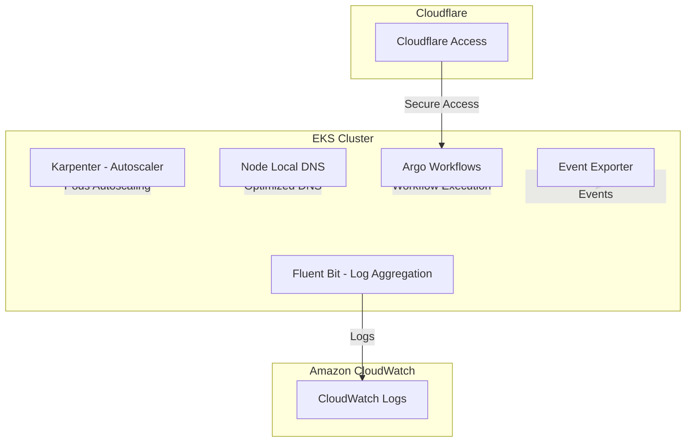

# Infrastructure

```mermaid
graph TD;
    subgraph AWS[EKS Cluster]
        direction TB;
        Karpenter[Karpenter - Autoscaler]
        NodeLocalDNS[Node Local DNS]
        Argo[Argo Workflows]
        EventExporter[Event Exporter]
        FluentBit[Fluent Bit - Log Aggregation]
    end

    subgraph CloudWatch[Amazon CloudWatch]
        Logs[CloudWatch Logs]
    end

    subgraph Cloudflare[Cloudflare]
        CloudflareAccess[Cloudflare Access]
    end

    Karpenter -->|Pods Autoscaling| AWS
    NodeLocalDNS -->|Optimized DNS| AWS
    Argo -->|Workflow Execution| AWS
    EventExporter -->|Captures Kubernetes Events| AWS

    FluentBit -->|Logs| Logs
    CloudflareAccess -->|Secure Access| Argo
```
