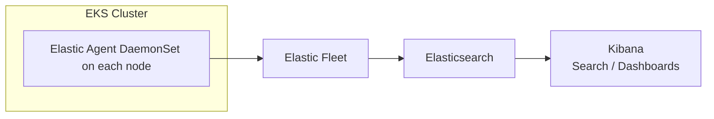

# Elastic Agent

The agent runs as a DaemonSet and collects:
- Kubernetes logs
- Container metrics
- Node metrics
- System metrics

Each node runs one Elastic Agent pod.

## Investigating the metrics

Index: `metrics-*`

- Filter on the cluster: `"aws.tags.eks:cluster-name": "Workflows"`
- `kubernetes.container.*` fields give information about the container metrics, e.g `kubernetes.container.memory.usage.bytes`.
