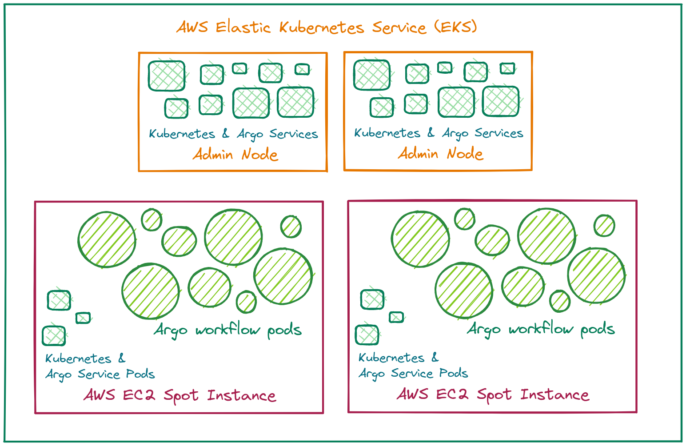

# Argo Workflows Training Workshop

## Workshop Aims

## Workshop Contents

- Introduction to the tech ecosystem: containerisation, Kubernetes, Argo Workflows
- The structure of an Argo workflow; workflow concepts
- Creating and running workflows from the UI
- Creating and running workflows from the command line
- Monitoring your running workflows - how to view logs and get Kubernetes events
- How the Topo workflows are structured – example using the standardising workflow
- The codebase (containers) behind the Topo workflows
- Running a real world workflow – historical imagery or raster data store workflows
- How to get help from TDE

## Workshop Pre-Requisites

### AWS CLI v2

[https://docs.aws.amazon.com/cli/latest/userguide/getting-started-install.html](https://docs.aws.amazon.com/cli/latest/userguide/getting-started-install.html)

### Install Git CLI and clone the Topo Workflows GitHub repository

```bash
sudo apt-get update
sudo apt-get install git
git clone https://github.com/linz/topo-workflows.git
```

This will create a copy of the Topo Workflows repository locally.

### `kubectl`

[https://kubernetes.io/docs/tasks/tools/](https://kubernetes.io/docs/tasks/tools/)

### Argo CLI

[https://github.com/argoproj/argo-workflows/releases/](https://github.com/argoproj/argo-workflows/releases/)

## Argo Workflows, Kubernetes and AWS Elastic Kubernetes Service

[Argo Configuration Guide - Introduction to Argo Workflows](../../CONFIGURATION.md#IntroductiontotheArgoWorkflowsEnvironment)



## What is a workflow?

An workflow is a YAML (or JSON) document that specifies the tasks to be carried out and the settings that should be applied to the workflow and the tasks. The workflow document is submitted to Argo and is scheduled and run using AWS EC2 resources that are dynamically requested and assigned.

## Diagram of workflow structure

> Instructor notes:
>
> Go through each section. Explain this is very simplified and we will look at a more detailed version later on.


## Creating and running workflows

### Running workflows from the UI

> Instructor notes:
>
> Explain the difference between Workflows and Workflow Templates

#### UI "hello world" example

> Instructor notes:
>
> There are simpler ways to do this, but this is more consistent with our workflows. Example: could specify the container in the main template as there is only one task. Also we are going to use DAG and tasks instead of steps.

Create a new file called `wf_helloworld.yaml` containing the following YAML:

```yaml
apiVersion: argoproj.io/v1alpha1
kind: Workflow
metadata:
  generateName: test-name-hello-world-
  namespace: argo
spec:
  entrypoint: main
  arguments:
    parameters:
      - name: message
        value: "hello world"
  templates:
    - name: main
      dag:
        tasks:
          - name: say-hello-task
            template: say-hello-template
            arguments:
              parameters:
                - name: message
                  value: "{{workflow.parameters.message}}"
    - name: say-hello-template
      inputs:
        parameters:
          - name: message
      container:
        image: "019359803926.dkr.ecr.ap-southeast-2.amazonaws.com/eks:topo-imagery-v1"
        command: [echo]
        args: ["{{inputs.parameters.message}}"]
```

Submit the workflow through the UI.

#### "hello world" example with argument parameter

> Instructor notes:
>
> Show how the parameters are passed through the workflow

Create a new file called `wf_helloworld_args.yaml` containing the following YAML:

```yaml
apiVersion: argoproj.io/v1alpha1
kind: Workflow
metadata:
  generateName: test-name-hello-world-
  namespace: argo
spec:
  entrypoint: main
  arguments:
    parameters:
      - name: message
        value: "hello world"
  templates:
    - name: main
      dag:
        tasks:
          - name: say-hello-task
            template: say-hello-template
            arguments:
              parameters:
              - name: message
                  value: "{{workflow.parameters.message}}"
    - name: say-hello-template
      inputs:
        parameters:
          - name: message
      container:
        image: "019359803926.dkr.ecr.ap-southeast-2.amazonaws.com/eks:topo-imagery-v1"
        command: [echo]
        args: ["{{inputs.parameters.message}}"]
```

### Creating and running workflows from the CLI

In a terminal window, log in to `li-topo-prod` using AWS CLI.

Check your connection to Argo:

```bash
kubectl get pods -n argo
argo list -n argo
```

In the above commands, `-n argo` means specify the argo "namespace". This is a way of separating Kubernetes pods into different areas. In our environment, these are only used for functions of the infrastructure, e.g. server functions or monitoring. You can try the commands with the option `-A` to specify all namespaces instead of `-n argo` and see which other pods are running.

For Argo CLI, you can set the environment variable `ARGO_NAMESPACE=argo` so you don’t have to specify the namespace in your argo commands.

You can also do that for kubectl if you want to:
`kubectl config set-context --current --namespace=argo`

#### CLI "hello world" example

`argo submit docs/training/wf_helloworld.yaml -n argo --watch`

#### CLI "hello world" example with argument parameters

`argo submit docs/training/wf_helloworld_args.yaml p message1="hello world" --watch`

#### Monitoring your running workflows - how to view logs and get events

- [Argo CLI documentation](https://argoproj.github.io/argo-workflows/cli/argo/)
- [Kubernetes Cheat Sheet](https://kubernetes.io/docs/reference/kubectl/cheatsheet/)

More TBA get events get logs

#### UI "hello world" example with arguments containing two tasks

> Instructor notes:
>
> This workflow will run two tasks at the same time. Go through it with workshop attendees. In this case we are using the same "say-hello-template" template. These tasks could reference different templates.

Add another step to `wf_helloworld_args.yaml` and another parameter for it.

```yaml
apiVersion: argoproj.io/v1alpha1
kind: Workflow
metadata:
  generateName: test-name-hello-world-
  namespace: argo
spec:
  entrypoint: main
  arguments:
    parameters:
      - name: message1
        value: "hello world 1"
      - name: message2
        value: "hello world 2"
  templates:
    - name: main
      dag:
        tasks:
          - name: say-hello-task1
            template: say-hello-template
            arguments:
              parameters:
                - name: message
                  value: "{{workflow.parameters.message1}}"
          - name: say-hello-task2
            template: say-hello-template
            arguments:
              parameters:
                - name: message
                  value: "{{workflow.parameters.message2}}"
    - name: say-hello-template
      inputs:
        parameters:
          - name: message
      container:
        image: "019359803926.dkr.ecr.ap-southeast-2.amazonaws.com/eks:topo-imagery-v1"
        command: [echo]
        args: ["{{inputs.parameters.message}}"]
```

Submit the workflow through the CLI.

### DAG example - dependent tasks

> Instructor notes:
>
> Running tasks in order using dependencies. Fan in, fan out.

```yaml
apiVersion: argoproj.io/v1alpha1
kind: Workflow
metadata:
  generateName: test-name-hello-world-
  namespace: argo
spec:
  entrypoint: main
  arguments:
    parameters:
      - name: message1
        value: "hello world 1"
      - name: message2
        value: "hello world 2"
  templates:
    - name: main
      dag:
        tasks:
          - name: say-hello-task1
            template: say-hello-template
            arguments:
              parameters:
                - name: message
                  value: "{{workflow.parameters.message1}}"
          - name: say-hello-task2
            template: say-hello-template
            arguments:
              parameters:
                - name: message
                  value: "{{workflow.parameters.message2}}"
            depends: "say-hello-task1"
          - name: say-hello-task3
            template: say-hello-template
            arguments:
              parameters:
                - name: message
                  value: "say hello task 3"
            depends: "say-hello-task1"
          - name: say-hello-task4
            template: say-hello-template
            arguments:
              parameters:
                - name: message
                  value: "say hello task 4"
            depends: "say-hello-task2 && say-hello-task3"
    - name: say-hello-template
      inputs:
        parameters:
          - name: message
      container:
        image: "019359803926.dkr.ecr.ap-southeast-2.amazonaws.com/eks:topo-imagery-v1"
        command: [echo]
        args: ["{{inputs.parameters.message}}"]
```

> Instructor notes:
>
> Fanning in and fanning out. Power of Argo Workflows - can automate this to create multiple parallel tasks

### DAG example - parallelising a task to run in multiple pods

_Content TBA_

## Inputs and Outputs - passing information between tasks in a Workflow

_Content TBA_

## A Workflow example: standardising workflow

General structure:


Go through the Standardising YAML file in more detail - any questions?

## Referencing other Workflows/WorkflowTemplates

> Instructor notes:
>
> This is possible and is done in the standardising-publish-import but it is a more advanced topic and will not be covered in this workshop.

## The codebase and containers behind the Topo workflows

| **Container**                                                                    | **Purpose**                                                                       |
| -------------------------------------------------------------------------------- | --------------------------------------------------------------------------------- |
| [topo-imagery](https://github.com/linz/topo-imagery/pkgs/container/topo-imagery) | Python scripts that need to use the GDAL library and geospatial Python libraries. |
| [argo-tasks](https://github.com/linz/argo-tasks/pkgs/container/argo-tasks)       | Reusable utility tasks written in TypeScript.                                     |
| [basemaps-cli](https://github.com/linz/basemaps/pkgs/container/basemaps%2Fcli)   | Controls Basemaps configuration.                                                  |

## Running a real world workflow – historical imagery or raster data store workflows

Setting up the bulk workflow runs - Megan's script - Content TBA\_

## How to get help from TDE

Ask on the `#team=topo-data-engineering` Slack channel :smile:

If you have a question about a particular Workflow that has run on Argo, you can tag `@squad-de-dev` in the relevant thread in the `#alert-argo-workflows` Slack channel.
