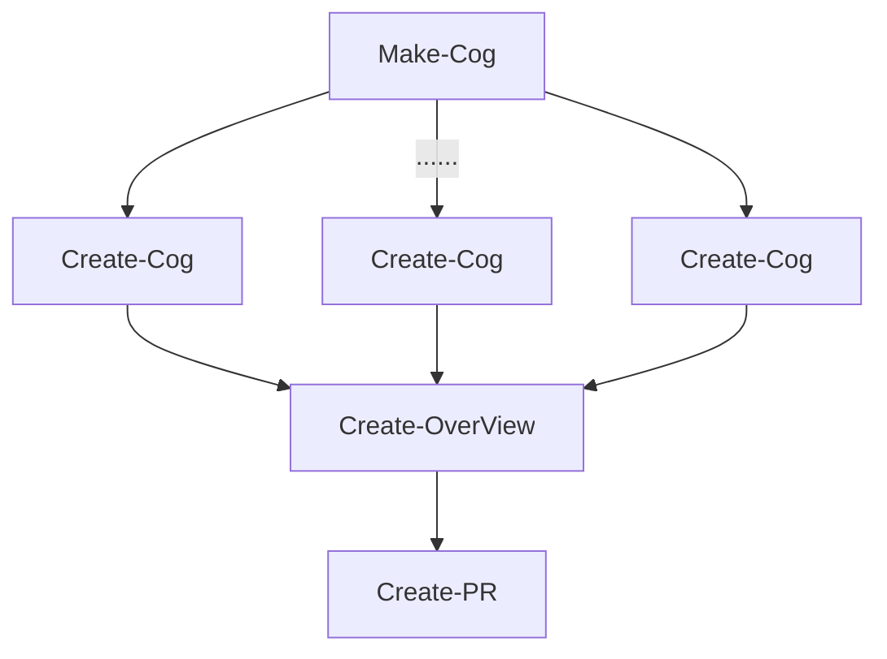
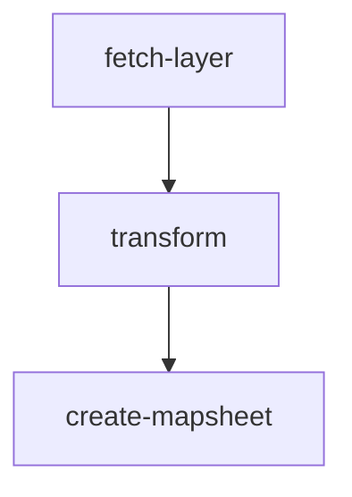

# Contents:

- [Imagery-Import](#Imagery-Import)
- [Mapsheet-Json](#Mapsheet-Json)
- [Create-Config](#Create-Config)
- [Create-Overview](#Create-Overview)
- [Create-Overview-All](#Create-Overview-All)

# Imagery-Import

## Workflow Description

This workflow is used for importing imagery into Basemaps, it usually takes imagery from `linz-imagery` bucket and processes both 2193 and 3857 projection into Basemaps. Also, there is an option to create pull request automatically which adds the new imagery into [basemaps-config](https://github.com/linz/basemaps-config) aerial map.

## Workflow Description



### [Make-Cog](https://github.com/linz/basemaps/blob/master/packages/cli/src/cli/cogify/action.make.cog.ts)

Loop through the source tiffs and prepare cog tiff jobs and bundle the jobs for create-cog task to create cog tiffs.

We chunk up to 100 small cogs, 40 middle cogs, 10 large cogs, or mix of them with the same limitation into one create-cog job in order to limit the create-cog task so it can finish in about 20 mins.

### [Create-Cog](https://github.com/linz/basemaps/blob/master/packages/cli/src/cli/cogify/action.cog.ts)

Running gdal commands to create cog tiffs.

**gdalbuildvrt**

```
gdalbuildvrt -hidenodata -allow_projection_difference -addalpha ${source.vrt} ${source tiffs}
```

**gdalwarp**

```
gdalwarp -of VRT -multi -wo NUM_THREADS=ALL_CPUS -s_srs EPSG:2193 -t_srs EPSG:3857 -tr ${target_resolution} -tap -cutline ${cutline.geojson} -cblend ${blend} -r bilinear ${source.vrt} ${cog.vrt}
```

**gdal_translate**

```
gdal_translate -of COG -co TILING_SCHEME=GoogleMapsCompatible -co NUM_THREADS=ALL_CPUS -co BIGTIFF=YES -co ADD_ALPHA=YES -co BLOCKSIZE=512 -co WARP_RESAMPLING=bilinear -co OVERVIEW_RESAMPLING=lanczos -co COMPRESS=webp -co ALIGNED_LEVELS=5 -co QUALITY=90 -co SPARSE_OK=YES --config GDAL_DISABLE_READDIR_ON_OPEN EMPTY_DIR -tr ${target_resolution} -projwin ${bbox} -projwin_srs EPSG:3857 ${cog.vrt} ${output_cog.tiff}
```

### [Create-Overview](#Create-Overview)

This create webp overview tar file for the output cogs which can be used for Basemaps server.

### [Create-PR](https://github.com/linz/basemaps/blob/master/packages/cli/src/cli/cogify/action.make.cog.pr.ts)

This create pull request in the [basemaps-config](https://github.com/linz/basemaps-config) repository and add the new imagery layer into aerial.json config.

## Workflow Input Parameters

| Parameter     | Type | Default                                                                                | Description                                                                                                                                                                                                                    |
| ------------- | ---- | -------------------------------------------------------------------------------------- | ------------------------------------------------------------------------------------------------------------------------------------------------------------------------------------------------------------------------------ |
| source        | str  | null                                                                                   | The s3 path contains source tiff files that we want to import into Basemaps. Usually from `linz-imagery` bucket.                                                                                                               |
| name          | str  | null                                                                                   | The imagery name we want to import. Following the convention name-year-resolution, like `invercargill_2022_0.05m` or `christchurch_2020-2021_0-075m_RGB`.                                                                      |
| target        | enum | linz-basemaps                                                                          | S3 bucket that we want to import into. `--linz-basemaps` for production and `--linz-basemaps-staging` for dev.                                                                                                                 |
| tile-matrix   | enum | NZTM2000Quad/WebMercatorQuad                                                           | Target TileMatrix we want to import as. `--NZTM2000Quad/WebMercatorQuad` to import two layers for both NZTM2000Quad and WebMercatorQuad. `--NZTM2000Quad` for NZTM2000Quad only. `--WebMercatorQuad` for WebMercatorQuad Only. |
| cutline       | str  | s3://linz-basemaps-source/cutline/2020-05-07-cutline-nz-coasts-rural-and-urban.geojson | The cutline is used to clip source imagery                                                                                                                                                                                       |
| blend         | int  | 20                                                                                     | How much blending to consider when working out boundaries.                                                                                                                                                                     |
| aligned-level | int  | 6                                                                                      | How much do we want to align the output cog tiff from the source tiff resolution zoom level. `(zoom = resolution_zoom - aligned_level)`                                                                                         |

# Mapsheet-Json

## Workflow Description

This workflow to used for find out which COGs intersect with a 1:50k tile in order to build ECWs for Topo50 map sheet.

## Workflow Description



### [fetch-layer](https://github.com/linz/argo-tasks/blob/master/src/commands/lds-cache/lds.cache.ts)

Fetch and download layer as geopackage from [lds-cache](https://github.com/linz/lds-cache).

### transform

Transform geopackage to flatgeobuf using the following gdal command.

Docker: gdal:alpine-small-3.5.0

```
ogr2ogr -f FlatGeobuf /tmp/flatGeobuf.fgb /tmp/geopackage.gpkg

```

### [create-mapsheet](https://github.com/linz/basemaps/blob/master/packages/cli/src/cli/config/action.cog.mapsheet.ts)

This command loops trough the existing layers and find intersection between Tile Index and layers, then output the mapsheet.json.

## Workflow Input Parameters

| Parameter | Type | Default      | Description                                                                                                   |
| --------- | ---- | ------------ | ------------------------------------------------------------------------------------------------------------- |
| layer     | int  | 104687       | LINZ Data Service Layer Id for [1:50K Tile Index](https://data.linz.govt.nz/layer/104687-nz-150k-tile-index/) |
| includes  | str  | null         | Regex pattern to include the Basemaps layers by layer name, default null to include everything.               |
| excludes  | str  | nz_satellite | Regex pattern to exclude the Basemaps layers by layer name, default to exclude nz_satellite layer.            |

## Workflow Outputs Example

mapsheet.json

```
[
{
"sheetCode": "BY26",
"files": [
"s3://linz-basemaps/2193/nz_satellite_2021-2022_10m_RGB/01G73E4AMSQ91TXQ3KC90NNPA0/4-7-8.tiff"
]
},
{
"sheetCode": "BX26",
"files": [
"s3://linz-basemaps/2193/nz_satellite_2021-2022_10m_RGB/01G73E4AMSQ91TXQ3KC90NNPA0/4-7-8.tiff"
]
},
...
]
```

# Create-config

This workflow is used to create a configuration for a path of TIFF files and provide a preview link with Basemaps system.

It is mainly used for the Standardising workflow to provide visual QA for the standarised imagery.

[Source-Code](https://github.com/linz/basemaps/blob/59a3e7fa847f64f5c83fc876b071db947407d14d/packages/cli/src/cli/config/action.imagery.config.ts)

## Workflow Input Parameters

| Parameter | Type | Default                                    | Description                       |
| --------- | ---- | ------------------------------------------ | --------------------------------- |
| location  | str  | s3://linz-workflow-artifacts/path_of_tiffs | the uri (path) to the input tiffs |

### Example Input Parameters

| Parameter | Value                                                                          |
| --------- | ------------------------------------------------------------------------------ |
| source    | s3://linz-workflow-artifacts/2022-11/30-imagery-standardising-v0.2.0-60-v9rwq/ |

## Workflow Outputs

The S3 path to the processed TIFFs and the Basemaps visualisation URL can be found in the create-config pod outputs.
for example:

**location:**: `s3://linz-workflow-artifacts/2022-11/30-imagery-standardising-v0.2.0-60-v9rwq/`

**uri:** `https://basemaps.linz.govt.nz?config=...`

# Create-Overview

## Workflow Description

This workflow is used to create webp overviews for tiffs and output overview.tar.co into the output location.

Overviews webps tar file contains tile/z/x/y.webp imagery files which covers lower zoom level of the tiffs file which can be load into Basemaps server and provide a high performance tile requests for low zoom level tiles from high resolution tiffs.

This is mainly used for the Standardising workflow and Imagery-Import workflow which creating overview automatically for the processed tiff files.

[Source-Code](https://github.com/linz/basemaps/tree/master/packages/cli/src/cli/overview)

## Workflow Input Parameters

| Parameter | Type | Default                                        | Description                                                                                                     |
| --------- | ---- | ---------------------------------------------- | --------------------------------------------------------------------------------------------------------------- |
| source    | str  | s3://linz-workflow-artifacts/path_of_tiffs/    | The URIs (paths) to the s3 tiff files.                                                                          |
| output    | str  | s3://linz-workflow-artifacts/path_of_overview/ | The URIs (paths) to store the output overview.tar.co file which normally uses same location of the tiff files. |

## Examples

Given a standardised imagery path and output the same path for the overview tar file.

### Publish:

**source:** `s3://linz-workflow-artifacts/2022-11/15-imagery-standardising-v0.2.0-56-x7699/flat/`

**output:** `s3://linz-workflow-artifacts/2022-11/15-imagery-standardising-v0.2.0-56-x7699/flat/`

# Create-Overview-All

## Workflow Description

This workflow is used for one-off job to create overview for all the existing imagery for the [Basemaps aerial map imageries](https://github.com/linz/basemaps-config/blob/master/config/tileset/aerial.json).

## Workflow Input Parameters

None inputs/outputs for this workflow.
