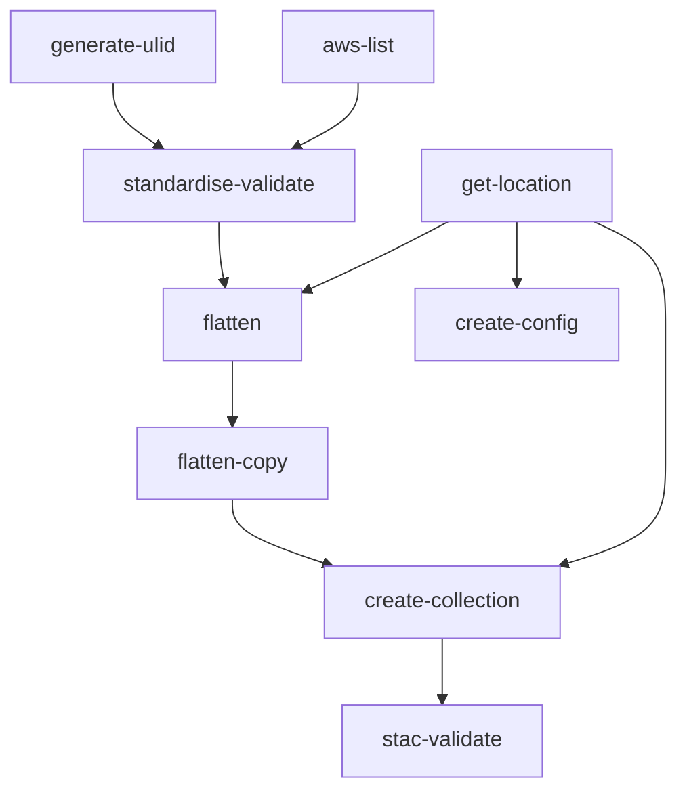
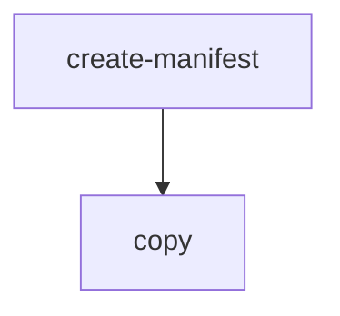

# Contents:

- [Standardising](#Standardising)
- [Publish-copy](#Publish-copy)
- [Tileset-validate](#Tileset-validate)
- [tests](#Tests)

# Standardising

This workflow processes supplied Aerial Imagery TIFF files into consistent Cloud Optimised GeoTIFFs with STAC metadata.
Standardisation using gdal_translate, non-visual QA, STAC creation, and STAC validation are all steps included within this workflow.
Upon completion all standardised TIFF and STAC files will be located with the ./flat/ directory of the workflow in the artifacts bucket.
In addition, a Basemaps link is produced enabling visual QA.

## Workflow Input Parameters

| Parameter      | Type  | Default                                                                                             | Description                                                                                                                                                                                                                  |
| -------------- | ----- | --------------------------------------------------------------------------------------------------- | ---------------------------------------------------------------------------------------------------------------------------------------------------------------------------------------------------------------------------- |
| source         | str   | s3://linz-imagery-staging/test/sample                                                               | the uri (path) to the input tiffs                                                                                                                                                                                            |
| include        | regex | .tiff?$                                                                                             | A regular expression to match object path(s) or name(s) from within the source path to include in standardising\*.                                                                                                           |
| scale          | enum  | 500                                                                                                 | The scale of the TIFFs                                                                                                                                                                                                       |
| group          | int   | 50                                                                                                  | The number of files to grouped into the pods (testing has recommended using 50 for large datasets).                                                                                                                          |
| compression    | enum  | webp                                                                                                | Standardised file format                                                                                                                                                                                                     |
| cutline        | str   |                                                                                                     | (Optional) location of a cutline file to cut the imagery to `.fgb` or `.geojson` (leave blank if no cutline)                                                                                                                 |
| title          | str   | \*Region/District/City\* \*GSD\* \*Urban/Rural\* Aerial Photos (\*Year-Year\*)                      | Collection title                                                                                                                                                                                                             |
| description    | str   | Orthophotography within the \*Region Name\* region captured in the \*Year\*-\*Year\* flying season. | Collection description                                                                                                                                                                                                       |
| start-datetime | str   | YYYY-MM-DD                                                                                          | Imagery start date (flown from), must be in default formatting                                                                                                                                                               |
| end-datetime   | str   | YYYY-MM-DD                                                                                          | Imagery end date (flown to), must be in default formatting                                                                                                                                                                   |
| copy-option    | enum  | --no-clobber                                                                                        | `--no-clobber` will not overwrite files if the name and the file size in bytes are the same. `--force` will overwrite all files. `--force-no-clobber` will only overwrite files of the same name that are of different sizes |

\* This regex can be used to exclude paths as well, e.g. if there are RBG and RGBI directories, the following regex will only include TIFF files in the RGB directory: `RGB(?!I).*.tiff?$`. For more complicated exclusions, there is an `--exclude` parameter, which would need to be added to the Argo WorkflowTemplate.

### Example Input Parameters

| Parameter      | Value                                                                                     |
| -------------- | ----------------------------------------------------------------------------------------- |
| source         | s3://linz-imagery-upload/PRJ39741_BOPLASS_Imagery_2021-22/PRJ39741_03/01_GeoTiff/         |
| include        | .tiff?$                                                                                   |
| scale          | 2000                                                                                      |
| group          | 50                                                                                        |
| compression    | webp                                                                                      |
| cutline        | s3://linz-imagery-staging/cutline/bay-of-plenty_2021-2022.fgb                             |
| title          | Bay of Plenty 0.2m Rural Aerial Photos (2021-2022)                                        |
| description    | Orthophotography within the Bay of Plenty region captured in the 2021-2022 flying season. |
| start-datetime | 2021-12-02                                                                                |
| end-datetime   | 2022-05-06                                                                                |
| copy-option    | --no-clobber                                                                              |

## Workflow Outputs

### Non-Visual QA

If non-visual QA fails the logs explain the failure, for example:

```json
{
  "file": "/tmp/2022_CG10_500_080038.tiff",
  "errors": [{ "type": "nodata", "message": "noDataValue not set" }],
  "level": 30,
  "time": 1668659399515,
  "v": 1,
  "pid": 28,
  "hostname": "imagery-standardising-v0.2.0-56-k4hxt-541810038",
  "id": "01GJ1XHSFRD23RTVEQ8SQFFBP2",
  "msg": "non_visual_qa_errors"
}
```

### Create Config

The S3 path to the processed TIFFs and the Basemaps visualisation URL can be found in the create-config pod outputs.
for example:

```
location: s3://linz-workflow-artifacts/2022-10/31-imagery-standardising-v0.02-58-df4gf
```

```
uri: https://basemaps.linz.govt.nz?config=...
```

## Workflow Description



### [generate-ulid](./standardising.yaml)

Generates a ULID which is used as the collection id for the standardised dataset.

### [aws-list](https://github.com/linz/argo-tasks/blob/master/src/commands/list/)

Lists all the included files within the provided source uri.

### [standardise-validate](https://github.com/linz/topo-imagery/blob/master/scripts/standardise_validate.py)

The following steps have been grouped together into standardise-validate.
This was done to reduce the number of times gdalinfo is run and files are looped.

#### [Standardise](https://github.com/linz/topo-imagery/blob/master/scripts/standardising.py)

Runs `gdal_translate` on the TIFF files, applying a cutline (if supplied) to remove unwanted pixels.
See [topo-imagery/scripts/gdal/gdal_preset.py](https://github.com/linz/topo-imagery/blob/master/scripts/gdal/gdal_preset.py) for gdal_translate options and arguments.

#### [Non-Visual QA](https://github.com/linz/topo-imagery/blob/master/scripts/files/file_check.py)

This step runs the following non-visual QA checks.

- **gdalinfo -stats -json** reports errors when running `gdalinfo`. The output is used for the checks below.

- **check tile and rename** standardises the filename to the format `MAPSHEET_GSD_TILE.tiff` (e.g. `BC40_2000_2421.tiff`) and reports errors if the origin does not align to the tile index by >=1.5cm.

- **no data** reports errors if the `noDataValue` isn't 255.

- **band count** reports if there are not 3 bands.

- **colour interpretation** reports if the band color interpretation is not Band 1 "Red", Band 2 "Green", Band 3 "Blue"`

- **srs** runs `gdalsrsinfo -o wkt "EPSG:2193"` and reports if the SRS is not 2193.

#### [Create Items](https://github.com/linz/topo-imagery/blob/master/scripts/create_stac.py)

Generates STAC item JSON file associated with the TIFF.
NB: currently only core STAC metadata is created: start-datetime, end-datetime, geometry and bbox (22/11/2022)

### [get-location](./standardising.yaml)

Finds the output location of this workflow within the artifacts bucket.

### [flatten](https://github.com/linz/argo-tasks/blob/master/src/commands/create-manifest/)

Creates a manifest list of the tiff and item files to copy.

### [flatten-copy](https://github.com/linz/argo-tasks/tree/master/src/commands/copy/)

Copies all the files listed in the manifest to a directory named /flat/

### [create-collection](https://github.com/linz/topo-imagery/blob/master/scripts/collection_from_items.py)

Iterates through the items within the `flat` directory and creates a collection.json.

### [stac-validate](./stac/readme.md)

Validates the collection.json and all associated items.

### [create-config](https://github.com/linz/basemaps/blob/59a3e7fa847f64f5c83fc876b071db947407d14d/packages/cli/src/cli/config/action.imagery.config.ts)

Creates a config of the imagery files within the `flat` directory and outputs a Basemaps link for Visual QA.

# Publish-copy

## Workflow Description

Copy files from one S3 location to another. This workflow is intended to be used after standardising and QA to copy:

- from `linz-workflow-artifacts` "flattened" directory to `linz-imagery`
- from `linz-imagery-upload` to `linz-imagery-staging` to store a copy of the uploaded RGBI imagery.



This is a two stage workflow that uses the [argo-tasks](https://github.com/linz/argo-tasks#create-manifest) container `create-manifest` (list of source and target file paths) and `copy` (the actual file copy) commands.

Access permissions are controlled by the [Bucket Sharing Config](https://github.com/linz/topo-aws-infrastructure/blob/master/src/stacks/bucket.sharing.ts) which gives Argo Workflows access to the S3 buckets we use.

## Workflow Input Parameters

| Parameter   | Type  | Default                                       | Description                                                                                                                                                                                                                  |
| ----------- | ----- | --------------------------------------------- | ---------------------------------------------------------------------------------------------------------------------------------------------------------------------------------------------------------------------------- |
| source      | str   | s3://linz-imagery-staging/test/sample/        | The URIs (paths) to the s3 source location                                                                                                                                                                                   |
| target      | str   | s3://linz-imagery-staging/test/sample_target/ | The URIs (paths) to the s3 target location                                                                                                                                                                                   |
| include     | regex | .tiff?\$\|.json\$\|.tfw\$                     | A regular expression to match object path(s) or name(s) from within the source path to include in the copy.                                                                                                                  |
| copy-option | enum  | --no-clobber                                  | `--no-clobber` will not overwrite files if the name and the file size in bytes are the same. `--force` will overwrite all files. `--force-no-clobber` will only overwrite files of the same name that are of different sizes |

## Examples

### Publish:

**source:** `s3://linz-workflow-artifacts/2022-11/15-imagery-standardising-v0.2.0-56-x7699/flat/`

**target:** `s3://linz-imagery/southland/invercargill_2022_0.1m/rgb/2193/`

**include:** Although only `.tiff` and `.json` files are required, there should not be any `.tfw` files in with the standardised imagery, so this option can be left at the default.

**copy-option:** `--no-clobber`

**Target path naming convention:** `s3://linz-imagery/<region>/<city-or-sub-region>_<year>_<resolution>/<product>/<crs>/`

### Backup RGBI:

**source:** `s3://linz-imagery-upload/Invercargill2022_Pgrm3016/OutputPGRM3016-InvercargillRural2022/tifs-RGBI/`

**target:** `s3://linz-imagery-staging/RGBi4/invercargill_urban_2022_0.1m/`

**include:** Although only `.tif(f)` and `.tfw` files are required, there should not be any `.json` files in with the uploaded imagery, so this option can be left at the default.

**copy-option:** `--no-clobber`

# Tileset-validate

## Workflow Description

Validate TIFFs are named the same as their tileset and that the origin and size is as expected. Uses the [argo-tasks](https://github.com/linz/argo-tasks/blob/master/src/commands/tileset-validate/tileset.validate.ts) container `tileset-validate` command.

## Workflow Input Parameters

| Parameter              | Type | Default                                              | Description                       |
| ---------------------- | ---- | ---------------------------------------------------- | --------------------------------- |
| processed-imagery-path | str  | s3://linz-imagery-staging/test/tileset-validate/flat | The URI (path) to the s3 location |

# Tests

The tests workflow has been created so that Python code and topo-imagery scripts can be tested in Argo.

## Workflow Inputs/Outputs

There are no inputs/outputs in this workflow as it is not a template.
Inputs/outputs can be hardcoded into the Python code.

## How To Use the Test Workflow

### Name

Please name your workflow: `test-*username*-*description*`
Starting the workflow name with `test` separates it from production workflows and ensures it is not logged in #alert-argo-workflows
Including your `username` and a short `description` provides context for the workflow.

### Container

This workflow uses [topo-imagery](https://github.com/linz/topo-imagery/pkgs/container/topo-imagery) so the [Dockerfile](https://github.com/linz/topo-imagery/blob/master/Dockerfile) and [pyproject.toml](https://github.com/linz/topo-imagery/blob/master/pyproject.toml) determine what is available to import and use.
Altering the workflow to use a different container would enable the use/testing of other resources if required.

### Code

Paste/write your code underneath the statement `# Put your code below`.
You can also use any of the scripts/code that have been published in the container.

### [Submitting the Workflow](../../README.md#submitting-a-job)
