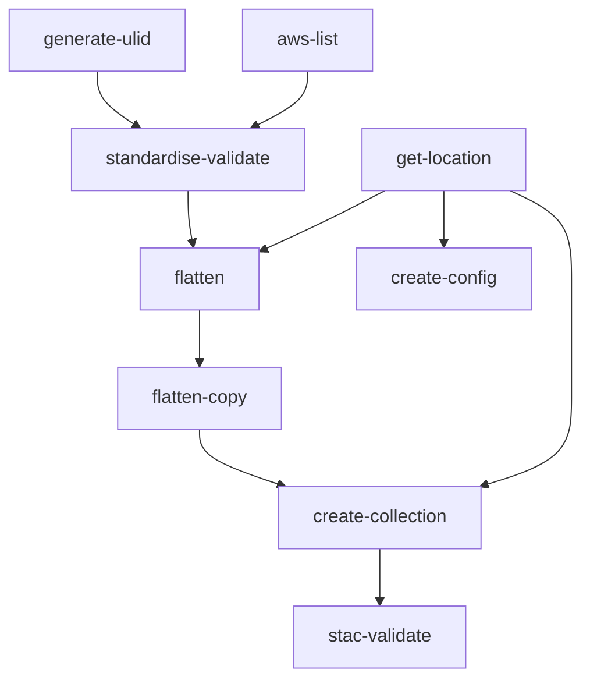
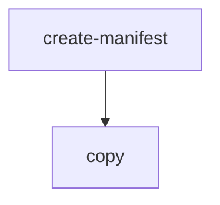

# Contents:

- [Standardising](#Standardising)
- [Publish-copy](#Publish-copy)

# Standardising

This workflow processes raw tiff files for the Topo Data Publishing Team (TDP).
Gdal_translate, non-visual qa, STAC creation, and STAC validation are all steps included within this workflow.
Upon completion all standardised tiff and STAC files will be located with the ./flat/ directory of the workflow in the artifacts bucket.
In addition, a basemaps link is produced enabling visual QA.

## Workflow Input Parameters

| Parameter      | Type  | Default                                            | Description                                                                                                                      |
| -------------- | ----- | -------------------------------------------------- | -------------------------------------------------------------------------------------------------------------------------------- |
| source         | str   | s3://linz-imagery-staging/test/sample              | the uri (path) to the input tiffs                                                                                                |
| include        | regex | .tiff?$                                            | The file types from within the source path to include in standardising                                                           |
| scale          | enum  | 500                                                | The scale of the tiffs                                                                                                           |
| group          | int   | 50                                                 | The number of files to grouped into the pods (testing has reccommended using 50 for large datasets).                             |
| compression    | enum  | webp                                               | Standardised file format                                                                                                         |
| title          | str   | \*Region\* \*Scale\* Aerial Photos (\*year/s\*)    | Collection title                                                                                                                 |
| description    | str   | \*Region\* \*Scale\* \*Urban/Rural\* Aerial Photos | Collection description                                                                                                           |
| start-datetime | str   | YYYY-MM-DD                                         | Imagery start date (flown from), must be in default formatting                                                                   |
| end-datetime   | str   | YYYY-MM-DD                                         | Imagery end date (flown to), must be in default formatting                                                                       |
| copy-option    | enum  | --no-clobber                                       | `--no-clobber` will not overwrite files if the name and the file size in bytes are the same. `--force` will overwrite all files. |

### Example Input Parameters

| Parameter      | Value                                                                             |
| -------------- | --------------------------------------------------------------------------------- |
| source         | s3://linz-imagery-upload/PRJ39741_BOPLASS_Imagery_2021-22/PRJ39741_03/01_GeoTiff/ |
| include        | .tiff?$                                                                           |
| scale          | 2000                                                                              |
| group          | 50                                                                                |
| compression    | webp                                                                              |
| title          | Bay of Plenty 0.2m Aerial Photos (2021-2022)                                      |
| description    | Bay of Plenty 0.2m Rural Aerial Photos                                            |
| start-datetime | 2021-12-02                                                                        |
| end-datetime   | 2022-05-06                                                                        |
| copy-option    | --no-clobber                                                                      |

## Workflow Outputs

### Non Visual QA

If non visual QA fails the logs explain the failure, for example:

```
{"file": "/tmp/2022_CG10_500_080038.tiff", "errors": [{"type": "nodata", "message": "noDataValue not set"}], "level": 30, "time": 1668659399515, "v": 1, "pid": 28, "hostname": "imagery-standardising-v0.2.0-56-k4hxt-541810038", "id": "01GJ1XHSFRD23RTVEQ8SQFFBP2", "msg": "non_visual_qa_errors"}
```

### Create Config

The s3 path to the processed tiffs and the basemaps visualisation URL can be found in the create-config pod outputs.
for example:

```
location: s3://linz-workflow-artifacts/2022-10/31-imagery-standardising-v0.02-58-df4gf
```

```
uri: https://basemaps.linz.govt.nz?config=...
```

## Workflow Description



### [generate-ulid](./standardising.yaml)

Generates a ULID which is used as the collection id for the standardised dataset.

### [aws-list](https://github.com/linz/argo-tasks/blob/master/src/commands/list/)

Lists all the included files within the provided source uri.

### [standardise-validate](https://github.com/linz/topo-imagery/blob/master/scripts/standardise_validate.py)

The follow steps have been grouped together into standardise-validate.
This was done to reduce the number of times gdalinfo is run and files are looped.

#### Standardise

Runs gdal_translate on the tiff files.
See [topo-imagery/scripts/gdal/gdal_preset.py](https://github.com/linz/topo-imagery/blob/master/scripts/gdal/gdal_preset.py) for gdal_translate options and arguments.

#### Non Visual QA

This step runs `no data`, `band count`, `colour interpretation`, and `srs` non visual QA checks.

#### Create Items

Generates stac item json file associated with the tiff.
nb: currently only core stac is created: start-datetime, end-datetime, geometry and bbox (22/11/2022)

### [get-location](./standardising.yaml)

Finds the output location of this workflow within the artifacts bucket.

### [flatten](https://github.com/linz/argo-tasks/blob/master/src/commands/create-manifest/)

Creates a manifest list of the tiff and item files to copy.

### [flatten-copy](https://github.com/linz/argo-tasks/tree/master/src/commands/copy/)

Copies all the files listed in the manifest to a directory named /flat/

### [create-collection](https://github.com/linz/topo-imagery/blob/master/scripts/collection_from_items.py)

Iterates through the items within the `flat` directory and creates a collection.json.

### [stac-validate](./stac/readme.md)

Validates the collection.json and all associated items.

### [create-config](https://github.com/linz/basemaps/blob/59a3e7fa847f64f5c83fc876b071db947407d14d/packages/cli/src/cli/config/action.imagery.config.ts)

Creates a config of the imagery files within the `flat` directory and outputs a basemaps link for Visual QA.

# Publish-copy

## Workflow Description

Copy files from one S3 location to another. This workflow is intended to be used after standardising and QA to copy:

- from `linz-workflow-artifacts` "flattened" directory to `linz-imagery`
- from `linz-imagery-uploads` to `linz-imagery-staging` to store a copy of the uploaded RGBI imagery.



This is a two stage workflow that uses the [argo-tasks](https://github.com/linz/argo-tasks#create-manifest) container `create-manifest` (list of source and target file paths) and `copy` (the actual file copy) commands.

Access permissions are controlled by the [Bucket Sharing Config](https://github.com/linz/topo-aws-infrastructure/blob/master/src/stacks/bucket.sharing.ts) which gives Argo Workflows access to the S3 buckets we use.

## Workflow Input Parameters

| Parameter   | Type  | Default                                       | Description                                                                                                                     |
| ----------- | ----- | --------------------------------------------- | ------------------------------------------------------------------------------------------------------------------------------- |
| source      | str   | s3://linz-imagery-staging/test/sample/        | The URIs (paths) to the s3 source location                                                                                      |
| target      | str   | s3://linz-imagery-staging/test/sample_target/ | The URIs (paths) to the s3 target location                                                                                      |
| include     | regex | .tiff?\$\|.json\$\|.tfw\$                     | The file types from within the source path to include in the copy.                                                              |
| copy-option | enum  | --no-clobber                                  | `--no-clobber` will not overwrite files if the name and the file size in bytes are the same. `--force` will overwrite all files |

## Examples

### Publish:

**source:** `s3://linz-workflow-artifacts/2022-11/15-imagery-standardising-v0.2.0-56-x7699/flat/`

**target:** `s3://linz-imagery/southland/invercargill_2022_0.1m/rgb/2193/`

**include:** Although only `.tiff` and `.json` files are required, there should not be any `.tfw` files in with the standardised imagery, so this option can be left at the default.

**copy-option:** `--no-clobber`

### Backup RGBI:

**source:** `s3://linz-imagery-upload/Invercargill2022_Pgrm3016/OutputPGRM3016-InvercargillRural2022/tifs-RGBI/`

**target:** `s3://linz-imagery-staging/RGBi4/invercargill_urban_2022_0.1m/`

**include:** Although only `.tif(f)` and `.tfw` files are required, there should not be any `.json` files in with the uploaded imagery, so this option can be left at the default.

**copy-option:** `--no-clobber`
