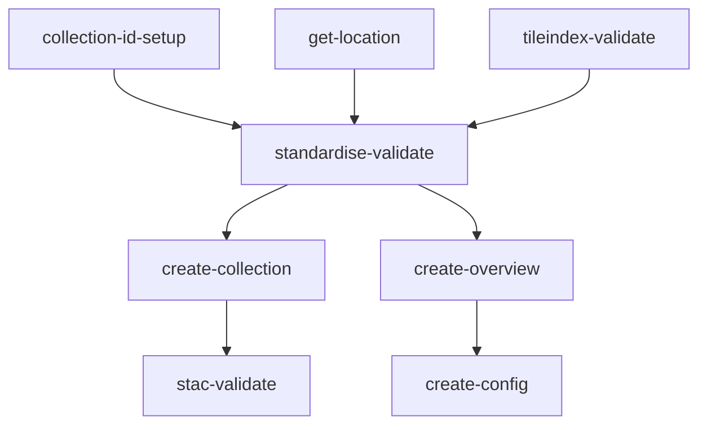
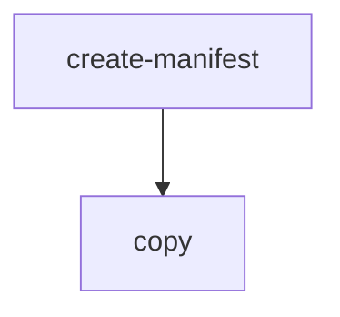
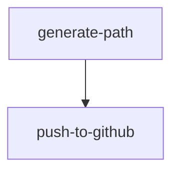

# Contents:

- [Standardising](#Standardising)
- [copy](#copy)
- [publish-odr](#Publish-odr)
- [Standardising-publish-import](#Standardising-publish-import)
- [tests](#Tests)

# Standardising

This workflow processes supplied Aerial Imagery TIFF files into consistent Cloud Optimised GeoTIFFs with STAC metadata.
Standardisation using gdal_translate, non-visual QA, STAC creation, and STAC validation are all steps included within this workflow.
Upon completion all standardised TIFF and STAC files will be located with the ./flat/ directory of the workflow in the artifacts bucket.
In addition, a Basemaps link is produced enabling visual QA.

## Workflow Input Parameters

| Parameter              | Type  | Default                               | Description                                                                                                                                                                                                                 |
| ---------------------- | ----- | ------------------------------------- | --------------------------------------------------------------------------------------------------------------------------------------------------------------------------------------------------------------------------- |
| ticket                 | str   |                                       | Ticket ID e.g. 'AIP-55'                                                                                                                                                                                                     |
| region                 | enum  |                                       | Region of the dataset                                                                                                                                                                                                       |
| source                 | str   | s3://linz-imagery-staging/test/sample | the uri (path) to the input tiffs                                                                                                                                                                                           |
| include                | regex | .tiff?$                               | A regular expression to match object path(s) or name(s) from within the source path to include in standardising\*.                                                                                                          |
| scale                  | enum  | 500                                   | The scale of the TIFFs                                                                                                                                                                                                      |
| validate               | enum  | true                                  | Validate the TIFFs files with `tileindex-validate`.                                                                                                                                                                         |
| retile                 | enum  | false                                 | Prepare the data for retiling TIFFs files to `scale` with `tileindex-validate`.                                                                                                                                             |
| group                  | int   | 50                                    | The number of files to group into the pods (testing has recommended using 50 for large datasets).                                                                                                                           |
| compression            | enum  | webp                                  | Standardised file format                                                                                                                                                                                                    |
| cutline                | str   |                                       | (Optional) location of a cutline file to cut the imagery to `.fgb` or `.geojson` (leave blank if no cutline)                                                                                                                |
| collection_id          | str   |                                       | (Optional) Provide a Collection ID if re-processing an existing published survery, otherwise a ULID will be generated for the collection.json ID field.                                                                     |
| category               | enum  | urban-aerial-photos                   | Dataset type for collection metadata, also used to Build Dataset title & description                                                                                                                                        |
| gsd                    | str   | 0.3m                                  | Dataset GSD for collection metadata, also used to build dataset title                                                                                                                                                       |
| producer               | enum  | Unknown                               | Imagery producer :warning: Ignored if `producer_list` is used.                                                                                                                                                              |
| producer_list          | str   |                                       | List of imagery producers, separated by semicolon (;). :warning: Has no effect unless a semicolon delimited list is entered.                                                                                                |
| licensor               | enum  | Unknown                               | Imagery licensor. :warning: Ignored if `licensor_list` is used.                                                                                                                                                             |
| licensor_list          | str   |                                       | List of imagery licensors, separated by semicolon (;). :warning: Has no effect unless a semicolon delimited list is entered.                                                                                                |
| start_datetime         | str   | YYYY-MM-DD                            | Imagery start date (flown from), must be in default formatting                                                                                                                                                              |
| end_datetime           | str   | YYYY-MM-DD                            | Imagery end date (flown to), must be in default formatting                                                                                                                                                                  |
| geographic_description | str   | Hamilton                              | (Optional) Additional datatset description, to be used in dataset title / description in place of the Region.                                                                                                               |
| lifeycle               | enum  | Completed                             | Lifecycle Status of Collection, from [linz STAC extension](https://github.com/linz/stac/tree/master/extensions/linz#collection-fields). Options: `completed`, `preview`, `ongoing`, `under development`, `deprecated`       |
| event                  | str   | Cyclone Gabrielle                     | (Optional) Event name if dataset has been captured in association with an event.                                                                                                                                            |
| historic_survey_number | str   | SNC8844                               | (Optional) Survey Number associated with historical datasets.                                                                                                                                                               |
| copy_option            | enum  | --no-clobber                          | <dl><dt>`--no-clobber` </dt><dd> Skip overwriting existing files.</dd><dt> `--force` </dt><dd> Overwrite all files. </dd><dt> `--force-no-clobber` </dt><dd> Overwrite only changed files, skip unchanged files. </dd></dl> |
| source_epsg            | str   | 2193                                  | The EPSG code of the source imagery                                                                                                                                                                                         |
| target_epsg            | str   | 2193                                  | The target EPSG code - if different to source the imagery will be reprojected                                                                                                                                               |

\* This regex can be used to exclude paths as well, e.g. if there are RBG and RGBI directories, the following regex will only include TIFF files in the RGB directory: `RGB(?!I).*.tiff?$`. For more complicated exclusions, there is an `--exclude` parameter, which would need to be added to the Argo WorkflowTemplate.

### Example Input Parameters

| Parameter              | Value                                                                             |
| ---------------------- | --------------------------------------------------------------------------------- |
| ticket                 | AIP-55                                                                            |
| region                 | bay-of-plenty                                                                     |
| source                 | s3://linz-imagery-upload/PRJ39741_BOPLASS_Imagery_2021-22/PRJ39741_03/01_GeoTiff/ |
| include                | .tiff?$                                                                           |
| scale                  | 2000                                                                              |
| validate               | true                                                                              |
| retile                 | false                                                                             |
| group                  | 50                                                                                |
| compression            | webp                                                                              |
| cutline                | s3://linz-imagery-staging/cutline/bay-of-plenty_2021-2022.fgb                     |
| collection_id          | 01FP371BHWDSREECKQAH9E8XQ                                                         |
| category               | rural-aerial-photos                                                               |
| gsd                    | 0.3m                                                                              |
| producer               | Aerial Surveys                                                                    |
| licensor               | Toitū Te Whenua Land Information New Zealand                                      |
| licensor_list          | Waka Kotahi; Nelson City Council;Tasman District Council                          |
| start_datetime         | 2021-12-02                                                                        |
| end_datetime           | 2022-05-06                                                                        |
| location               | Napier                                                                            |
| lifecycle              | Completed                                                                         |
| event                  | Top of the South Floods                                                           |
| historic_survey_number | SNC3546                                                                           |
| copy_option            | --no-clobber                                                                      |
| source_epsg            | 2193                                                                              |
| target_epsg            | 2193                                                                              |

## Workflow Outputs

### Non-Visual QA

If non-visual QA fails the logs explain the failure, for example:

```json
{
  "file": "/tmp/2022_CG10_500_080038.tiff",
  "errors": [{ "type": "nodata", "message": "noDataValue not set" }],
  "level": 30,
  "time": 1668659399515,
  "v": 1,
  "pid": 28,
  "hostname": "imagery-standardising-v0.2.0-56-k4hxt-541810038",
  "id": "01GJ1XHSFRD23RTVEQ8SQFFBP2",
  "msg": "non_visual_qa_errors"
}
```

### Create Config

The S3 path to the processed TIFFs and the Basemaps visualisation URL can be found in the create-config pod outputs.
for example:

```
location: s3://linz-workflow-artifacts/2022-10/31-imagery-standardising-v0.02-58-df4gf
```

```
uri: https://basemaps.linz.govt.nz?config=...
```

## Workflow Description



### [collection-id-setup](./standardising.yaml)

Sets the collection ID for the workflow as the input parameter.
If no input collection ID is provided a ULID is generated and used as the collection id for the standardised dataset.

### [tileindex-validate](https://github.com/linz/argo-tasks/blob/master/src/commands/tileindex-validate/)

Lists tiffs from source input, validates they match a LINZ Mapsheet tile index and asserts that there will be no duplicates.

### [standardise-validate](https://github.com/linz/topo-imagery/blob/master/scripts/standardise_validate.py)

The following steps have been grouped together into standardise-validate.
This was done to reduce the number of times gdalinfo is run and files are looped.

#### [Standardise](https://github.com/linz/topo-imagery/blob/master/scripts/standardising.py)

Runs `gdal_translate` on the TIFF files, applying a cutline (if supplied) to remove unwanted pixels.
See [topo-imagery/scripts/gdal/gdal_preset.py](https://github.com/linz/topo-imagery/blob/master/scripts/gdal/gdal_preset.py) for gdal_translate options and arguments.

#### [Non-Visual QA](https://github.com/linz/topo-imagery/blob/master/scripts/files/file_check.py)

This step runs the following non-visual QA checks.

- **gdalinfo -stats -json** reports errors when running `gdalinfo`. The output is used for the checks below.

- **check tile and rename** standardises the filename to the format `MAPSHEET_GSD_TILE.tiff` (e.g. `BC40_2000_2421.tiff`) and reports errors if the origin does not align to the tile index by >=1.5cm.

- **no data** reports errors if the `noDataValue` isn't 255.

- **band count** reports if there are not 3 bands.

- **colour interpretation** reports if the band color interpretation is not Band 1 "Red", Band 2 "Green", Band 3 "Blue"`

- **srs** runs `gdalsrsinfo -o wkt "EPSG:2193"` and reports if the SRS is not 2193.

#### [Create Items](https://github.com/linz/topo-imagery/blob/master/scripts/stac/create_stac.py)

Generates STAC item JSON file associated with the TIFF.
NB: currently only core STAC metadata is created: start_datetime, end_datetime, geometry and bbox (22/11/2022)

> **_NOTE:_** The output files (`tiffs` and STAC metadata) are moved to a target directory `flat` within the workflow artifact bucket.

### [get-location](./standardising.yaml)

Finds the output location of this workflow within the artifacts bucket.

### [create-collection](https://github.com/linz/topo-imagery/blob/master/scripts/collection_from_items.py)

Iterates through the items within the `flat` directory and creates a collection.json. Also builds the dataset title and description using parameter inputs.

### [stac-validate](./stac/readme.md)

Validates the collection.json and all associated items.

### [create-config](https://github.com/linz/basemaps/blob/59a3e7fa847f64f5c83fc876b071db947407d14d/packages/cli/src/cli/config/action.imagery.config.ts)

Creates a config of the imagery files within the `flat` directory and outputs a Basemaps link for Visual QA.

# copy

## Workflow Description

Copy files from one S3 location to another. This workflow is intended to be used after standardising and QA to copy:

- from `linz-workflow-artifacts` "flattened" directory to `linz-imagery`
- from `linz-imagery-upload` to `linz-imagery-staging` to store a copy of the uploaded RGBI imagery.



This is a workflow that uses the [argo-tasks](https://github.com/linz/argo-tasks#create-manifest) container `create-manifest` (list of source and target file paths) and `copy` (the actual file copy) commands.

Access permissions are controlled by the [Bucket Sharing Config](https://github.com/linz/topo-aws-infrastructure/blob/master/src/stacks/bucket.sharing.ts) which gives Argo Workflows access to the S3 buckets we use.

## Workflow Input Parameters

| Parameter            | Type  | Default                                                                                                                                                       | Description                                                                                                                                                                                                                 |
| -------------------- | ----- | ------------------------------------------------------------------------------------------------------------------------------------------------------------- | --------------------------------------------------------------------------------------------------------------------------------------------------------------------------------------------------------------------------- |
| ticket               | str   |                                                                                                                                                               | Ticket ID e.g. 'AIP-55'                                                                                                                                                                                                     |
| region               | enum  |                                                                                                                                                               | Region of the dataset                                                                                                                                                                                                       |
| source               | str   | s3://linz-imagery-staging/test/sample/                                                                                                                        | The URIs (paths) to the s3 source location                                                                                                                                                                                  |
| target               | str   | s3://linz-imagery-staging/test/sample_target/                                                                                                                 | The URIs (paths) to the s3 target location                                                                                                                                                                                  |
| include              | regex | \\.tiff?\$\|\\.json\$\|\\.tfw$\|/capture-area\\.geojson$                                                                                                      | A regular expression to match object path(s) or name(s) from within the source path to include in the copy.                                                                                                                 |
| copy_option          | enum  | --no-clobber                                                                                                                                                  | <dl><dt>`--no-clobber` </dt><dd> Skip overwriting existing files.</dd><dt> `--force` </dt><dd> Overwrite all files. </dd><dt> `--force-no-clobber` </dt><dd> Overwrite only changed files, skip unchanged files. </dd></dl> |
| group                | int   | 1000                                                                                                                                                          | The maximum number of files for each pod to copy (will use the value of `group` or `group_size` that is reached first).                                                                                                     |
| group_size           | str   | 100Gi                                                                                                                                                         | The maximum group size of files for each pod to copy (will use the value of `group` or `group_size` that is reached first).                                                                                                 |
| transform            | str   | `f`                                                                                                                                                           | String to be transformed from source to target to renamed filenames, e.g. `f.replace("text to replace", "new_text_to_use")`. Leave as `f` for no transformation.                                                            |
| aws_role_config_path | str   | `s3://linz-bucket-config/config-write.elevation.json,s3://linz-bucket-config/config-write.imagery.json,s3://linz-bucket-config/config-write.topographic.json` | s3 URL or comma-separated list of s3 URLs allowing the workflow to write to a target(s).                                                                                                                                    |

## Examples

### Publish:

**source:** `s3://linz-workflow-artifacts/2022-11/15-imagery-standardising-v0.2.0-56-x7699/flat/`

**target:** `s3://linz-imagery/southland/invercargill_2022_0.1m/rgb/2193/`

**include:** Although only `.tiff` and `.json` files are required, there should not be any `.tfw` files in with the standardised imagery, so this option can be left at the default.

**copy_option:** `--no-clobber`

**Target path naming convention:** `s3://linz-imagery/<region>/<city-or-sub-region>_<year>_<resolution>/<product>/<crs>/`

### Backup RGBI:

**source:** `s3://linz-imagery-upload/Invercargill2022_Pgrm3016/OutputPGRM3016-InvercargillRural2022/tifs-RGBI/`

**target:** `s3://linz-imagery-staging/RGBi4/invercargill_urban_2022_0.1m/`

**include:** Although only `.tif(f)` and `.tfw` files are required, there should not be any `.json` files in with the uploaded imagery, so this option can be left at the default.

**copy_option:** `--no-clobber`

# Publish-odr

## Workflow Description

This workflow creates a GitHub pull request to be reviewed for publishing to `s3://nz-imagery` and `s3://nz-elevation` (the two AWS Registry of Open Data public S3 buckets). When the pull request is approved and merged, the files will be copied.




## Workflow Input Parameters

| Parameter          | Type  | Default                                   | Description                                                                                                                                                      |
| ------------------ | ----- | ----------------------------------------- | ---------------------------------------------------------------------------------------------------------------------------------------------------------------- |
| ticket             | str   |                                           | Ticket ID e.g. 'AIP-55'                                                                                                                                          |
| region             | enum  |                                           | Region of the dataset                                                                                                                                            |
| source             | str   | s3://linz-imagery-staging/test/sample/    | The URIs (paths) to the s3 source location                                                                                                                       |
| target_bucket_name | enum   | nz-imagery                                | The bucket name of the target location                                                                                                                  |                                                  |
| copy_option        | enum  | --no-clobber                           | <dl><dt>`--no-clobber` </dt><dd> Skip overwriting existing files.</dd><dt> `--force` </dt><dd> Overwrite all files. </dd><dt> `--force-no-clobber` </dt><dd> Overwrite only changed files, skip unchanged files. </dd></dl> |

## Examples

### Publish:

**source:** `s3://linz-workflow-artifacts/2022-11/15-imagery-standardising-v0.2.0-56-x7699/flat/`

**target_bucket_name:** `nz-imagery`

**copy_option:** `--no-clobber`

See the [copy template](#copy) for more information.

# Standardising-publish-import

**For command line use only**

This Workflow is intended for bulk imagery transfers which do not require Visual QA before publication.

This workflow carries out the steps in the [Standardising](#Standardising) workflow, followed by the steps in the [copy](#copy) workflow. Then, optionally, the [Basemaps-Imagery-Import](../basemaps/README.md#imagery-import) process can be run by uncommenting the relevant sections of the Workflow file and supplying the appropriate extra parameters.

## Workflow Input Parameters

### Standardising-Publish Mandatory Parameters - must be specified on the command line

| Parameter      | Type | Default | Description                                                                                                                                                     |
| -------------- | ---- | ------- | --------------------------------------------------------------------------------------------------------------------------------------------------------------- |
| ticket         | str  |         | Ticket ID e.g. 'AIP-55'                                                                                                                                         |
| region         | enum |         | Region of the dataset :warning: The name has to be exactly one in the region enum in `standardising`.                                                           |
| source         | str  |         | the uri (path) to the input tiffs e.g. s3://linz-imagery-upload/test/sample                                                                                     |
| target         | str  |         | the uri (path) to the published tiffs in the format s3://linz-imagery-target-example/region/city-or-sub-region_year_resolution/product/crs/                     |
| category       | enum |         | Dataset type for collection metadata, also used to Build Dataset title & description                                                                            |
| gsd            | str  |         | dataset GSD required for dataset title                                                                                                                          |
| producer       | str  |         | Imagery producer name :warning: The name has to be exactly one in the producer enum in `standardising.yaml`                                                     |
| licensor       | str  |         | Imagery licensor name :warning: The name has to be exactly one in the licensor enum in `standardising.yaml`. Use `licensor_list` instead if multiple licensors. |
| licensor_list  | str  |         | List of imagery licensor name :warning: The names have to be exactly some of the licensor enum in `standardising.yaml` and separated by a semicolon.            |
| start_datetime | str  |         | Imagery start date (flown from), must be in the format YYYY-MM-DD formatting                                                                                    |
| end_datetime   | str  |         | Imagery end date (flown to), must be in the format YYYY-MM-DD                                                                                                   |
| scale          | str  |         | The scale of the TIFFs, e.g. 500                                                                                                                                |

### Standardising-Publish Optional Parameters - can be specified on the command line to override default value

| Parameter              | Type  | Default      | Description                                                                                                                                                                                                                                                                                                          |
| ---------------------- | ----- | ------------ | -------------------------------------------------------------------------------------------------------------------------------------------------------------------------------------------------------------------------------------------------------------------------------------------------------------------- |
| cutline                | str   |              | (Optional) location of a cutline file to cut the imagery to `.fgb` or `.geojson` (do not include if no cutline)                                                                                                                                                                                                      |
| collection_id          | str   |              | (Optional) Provide a Collection ID if re-processing an existing published survery, otherwise a ULID will be generated for the collection.json ID field.                                                                                                                                                              |
| compression            | str   | webp         | Standardised file format. Must be `webp` or `lzw`                                                                                                                                                                                                                                                                    |
| group                  | int   | 50           | Applies to the standardising workflow. The number of files to group into the pods (testing has recommended using 50 for large datasets).                                                                                                                                                                             |
| include                | regex | .tiff?$      | Applies to the standardising workflow. A regular expression to match object path(s) or name(s) from within the source path to include in standardising\*.                                                                                                                                                            |
| copy_option            | str   | --no-clobber | Applies to the standardising and publishing workflows and should not need to be changed. <dl><dt>`--no-clobber` </dt><dd> Skip overwriting existing files.</dd><dt> `--force` </dt><dd> Overwrite all files. </dd><dt> `--force-no-clobber` </dt><dd> Overwrite only changed files, skip unchanged files. </dd></dl> |
| source_epsg            | str   | 2193         | The EPSG code of the source imagery.                                                                                                                                                                                                                                                                                 |
| target_epsg            | str   | 2193         | The Target EPSG code, if different to source-epsg the imagery will be reprojected.                                                                                                                                                                                                                                   |
| geographic_description | str   | ''           | (Optional) Additional dataset description, to be used in dataset title / description in place of the Region.                                                                                                                                                                                                         |
| lifecycle              | enum  | completed    | Lifecycle Status of Collection                                                                                                                                                                                                                                                                                       |
| event                  | str   | ''           | (Optional) Event name if dataset has been captured in association with an event.                                                                                                                                                                                                                                     |
| historic_survey_number | str   | ''           | (Optional) Survey Number associated with historical datasets.                                                                                                                                                                                                                                                        |

\* This regex can be used to exclude paths as well, e.g. if there are RBG and RGBI directories, the following regex will only include TIFF files in the RGB directory: `RGB(?!I).*.tiff?$`.

### Standardising-Publish Fixed Parameters - can only be changed by editing the workflow file

These are hardcoded due to parameter naming collisions in the downstream WorkflowTemplates and will likely not need to be changed.

| Parameter | Type  | Default                                  | Description                                                                                                                                         |
| --------- | ----- | ---------------------------------------- | --------------------------------------------------------------------------------------------------------------------------------------------------- |
| include   | regex | \\.tiff?\$\|\\.json$\|/capture-area\\.geojson$ | Applies to the publishing workflow. A regular expression to match object path(s) or name(s) from within the source path to include in publishing\*. |

\* This regex can be used to exclude paths as well, e.g. if there are RBG and RGBI directories, the following regex will only include TIFF files in the RGB directory: `RGB(?!I).*.tiff?$`.

### Basemaps-Imagery-Import Mandatory Parameters - must be specified on the command line if the Basemaps Imagery Import process will be run

Uncomment the relevant sections of the standardise-publish-import Workflow file and supply the appropriate extra parameters.

The following parameters are required. See [Basemaps Imagery Import README](../basemaps/README.md#imagery-import) for descriptions and values.

- category
- name
- tile-matrix
- blend
- aligned-level
- create-pull-request

### Basemaps-Imagery-Import Fixed Parameters - can only be changed by editing the workflow file

Uncomment the relevant sections of the standardise-publish-import Workflow file and supply the appropriate extra parameters.

These are hardcoded due to parameter naming collisions in the downstream WorkflowTemplates.

| Parameter | Type | Default                                                                                | Description                                                                                                      |
| --------- | ---- | -------------------------------------------------------------------------------------- | ---------------------------------------------------------------------------------------------------------------- |
| target    | str  | linz-basemaps                                                                          | S3 bucket that we want to import into. `linz-basemaps` for production and `linz-basemaps-staging` for dev.       |
| cutline   | str  | s3://linz-basemaps-source/cutline/2020-05-07-cutline-nz-coasts-rural-and-urban.geojson | Location of the Basemaps cutline file. Default is aerial imagery, will need to be changed for satellite imagery. |

## Examples

### Submitting from the command line using the `-p` (`--parameter`) option (standardising-publish):

```bash
argo submit workflows/raster/standardising-publish-import.yaml -n argo -p ticket="AIP-55" -p region="canterbury" -p source="s3://linz-imagery-source-example/aerial-imagery/new-zealand/christchurch_urban_2021_0.05m_RGB/" -p target="s3://linz-imagery-example/canterbury/christchurch_2021_0.05m/rgb/2193/" -p scale="500" -p group="29" -p cutline="s3://linz-imagery-cutline-example/historical-imagery-cutlines/2023-01-16_84fd68f/SNC50451-combined.fgb" -p category="Urban Aerial Photos" -p gsd="0.05m" -p producer="Aerial Surveys" -p licensor="Toitū Te Whenua Land Information New Zealand" -p start_datetime="2021-11-02" -p end_datetime="2021-12-02"
```

### Submitting from the command line using a parameters yaml file and the `-f` (`--parameter-file`) option (standardising-publish):

```bash
argo submit workflows/raster/standardising-publish-import.yaml -n argo -f params.yaml
```

_params.yaml_:

```yaml
ticket: 'AIP-55'
region: 'canterbury'
source: 's3://linz-imagery-source-example/aerial-imagery/new-zealand/christchurch_urban_2021_0.05m_RGB/'
target: 's3://linz-imagery-example/canterbury/christchurch_2021_0.05m/rgb/2193/'
scale: '500'
group: '29'
cutline: 's3://linz-imagery-cutline-example/historical-imagery-cutlines/2023-01-16_84fd68f/SNC50451-combined.fgb'
category: urban-aerial-photos
gsd: 0.05m
producer: 'Aerial Surveys'
licensor: 'Toitū Te Whenua Land Information New Zealand'
start_datetime: '2021-11-02'
end_datetime: '2021-12-02'
```

### Submitting from the command line using the `-p` (`--parameter`) option (standardising-publish-import):

```bash
argo submit workflows/raster/standardising-publish-import.yaml -n argo -p ticket="AIP-55" -p region="canterbury" -p source="s3://linz-imagery-source-example/aerial-imagery/new-zealand/christchurch_urban_2021_0.05m_RGB/" -p target="s3://linz-imagery-example/canterbury/christchurch_2021_0.05m/rgb/2193/" -p scale="500" -p group="29" -p cutline="s3://linz-imagery-cutline-example/historical-imagery-cutlines/2023-01-16_84fd68f/SNC50451-combined.fgb" -p gsd="0.05m" -p producer="Aerial Surveys" -p licensor="Toitū Te Whenua Land Information New Zealand" -p start_datetime="2021-11-02" -p end_datetime="2021-12-02" -p category="urban-aerial-photos" -p name="christchurch_2021_0.05m" -p tile-matrix="NZTM2000Quad/WebMercatorQuad" -p blend="20" -p aligned-level="6" -p create-pull-request="true"
```

### Submitting from the command line using a parameters yaml file and the `-f` (`--parameter-file`) option (standardising-publish-import):

```bash
argo submit workflows/raster/standardising-publish-import.yaml -n argo -f params.yaml
```

_params.yaml_:

```yaml
ticket: 'AIP-55'
region: 'canterbury'
source: 's3://linz-imagery-source-example/aerial-imagery/new-zealand/christchurch_urban_2021_0.05m_RGB/'
target: 's3://linz-imagery-example/canterbury/christchurch_2021_0.05m/rgb/2193/'
scale: '500'
group: '29'
cutline: 's3://linz-imagery-cutline-example/historical-imagery-cutlines/2023-01-16_84fd68f/SNC50451-combined.fgb'
gsd: '0.05m'
producer: 'Aerial Surveys'
licensor: ''
licensor_list: 'Waka Kotahi; Nelson City Council;Tasman District Council'
start_datetime: '2021-11-02'
end_datetime: '2021-12-02'
category: 'urban-aerial-photos'
name: 'christchurch_2021_0.05m'
tile-matrix: 'NZTM2000Quad/WebMercatorQuad'
blend: '20'
aligned-level: '6'
create-pull-request: 'true'
```

# Tests

## How To Use the Test Workflow

### Name

Please name your workflow: `test-*username*-*description*`
Starting the workflow name with `test` separates it from production workflows and ensures it is not logged in #alert-argo-workflows
Including your `username` and a short `description` provides context for the workflow.

### Container

This workflow uses [topo-imagery](https://github.com/linz/topo-imagery/pkgs/container/topo-imagery) so the [Dockerfile](https://github.com/linz/topo-imagery/blob/master/Dockerfile) and [pyproject.toml](https://github.com/linz/topo-imagery/blob/master/pyproject.toml) determine what is available to import and use.
Altering the workflow to use a different container would enable the use/testing of other resources if required.

### Code

Paste/write your code underneath the statement `# Put your code below`.
You can also use any of the scripts/code that have been published in the container.

### [Submitting the Workflow](../../README.md#submitting-a-job)
