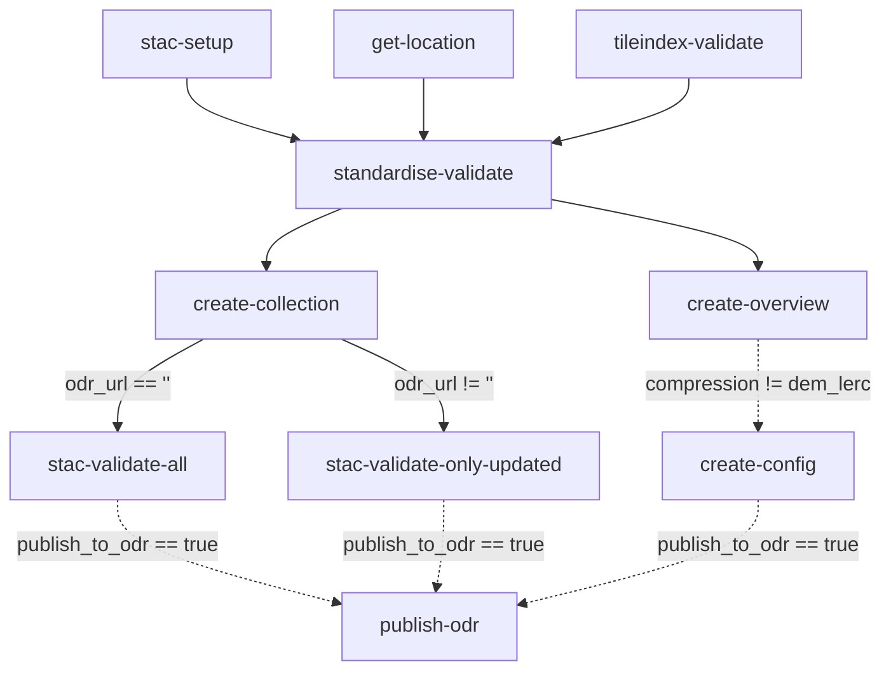
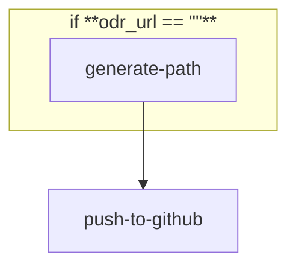
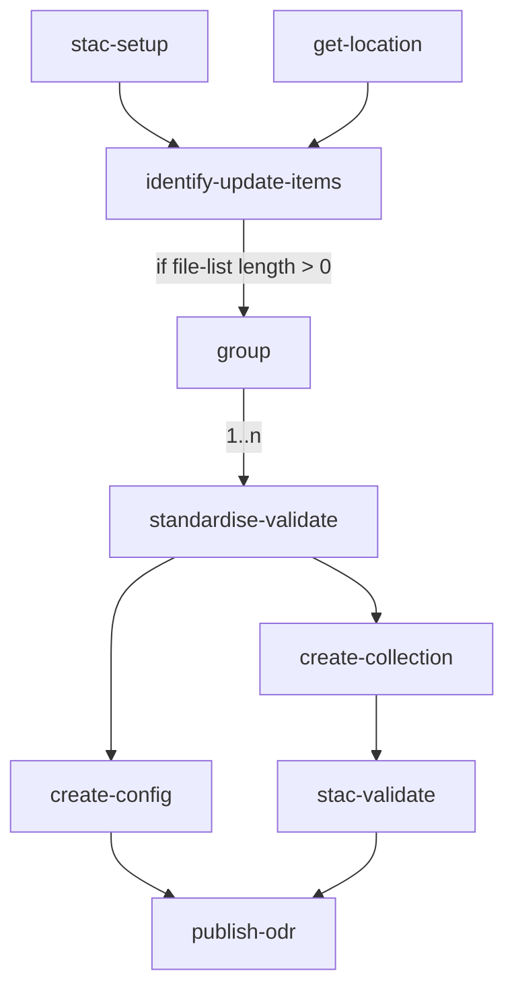

# Contents

- [Standardising](#Standardising)
- [publish-odr](#Publish-odr)
- [National Elevation](#national-elevation)
- [Merge Layers](#merge-layers)
- [Hillshade](#hillshade)
- [Hillshade Combinations](#hillshade-combinations)
- [tests](#Tests)

# Standardising

This workflow processes supplied Aerial Imagery and Elevation TIFF files into consistent Cloud Optimised GeoTIFFs with STAC metadata. Standardisation using gdal_translate, non-visual QA, STAC creation, and STAC validation are all steps included within this workflow.

Upon completion all standardised TIFF and STAC files will be located with the ./flat/ directory of the workflow in the artifacts scratch bucket. In addition, a Basemaps link is produced enabling visual QA.

Publishing to the AWS Registry of Open Data is an optional step [publish-odr](#Publish-odr) that can be run automatically after standardisation.

## Workflow Input Parameters

| Parameter                 | Type  | Default                               | Description                                                                                                                                                                                                                                                       |
| ------------------------- | ----- | ------------------------------------- | ----------------------------------------------------------------------------------------------------------------------------------------------------------------------------------------------------------------------------------------------------------------- |
| user_group                | enum  | none                                  | Group of users running the workflow                                                                                                                                                                                                                               |
| ticket                    | str   |                                       | Ticket ID e.g. 'AIP-55'                                                                                                                                                                                                                                           |
| region                    | enum  |                                       | Region of the dataset                                                                                                                                                                                                                                             |
| source                    | str   | s3://linz-imagery-staging/test/sample | the uri (path) to the input tiffs                                                                                                                                                                                                                                 |
| include                   | regex | .tiff?$                               | A regular expression to match object path(s) or name(s) from within the source path to include in standardising\*.                                                                                                                                                |
| scale                     | enum  | 500                                   | The scale of the TIFFs                                                                                                                                                                                                                                            |
| validate                  | enum  | true                                  | Validate the TIFFs files with `tileindex-validate`.                                                                                                                                                                                                               |
| retile                    | enum  | false                                 | Prepare the data for retiling TIFFs files to `scale` with `tileindex-validate`.                                                                                                                                                                                   |
| group                     | int   | 50                                    | The number of files to group into the pods (testing has recommended using 50 for large datasets).                                                                                                                                                                 |
| compression               | enum  | webp                                  | Standardised file format                                                                                                                                                                                                                                          |
| create_capture_area       | enum  | true                                  | Create a GeoJSON capture area for the dataset                                                                                                                                                                                                                     |
| cutline                   | str   |                                       | (Optional) location of a cutline file to cut the imagery to `.fgb` or `.geojson` (leave blank if no cutline)                                                                                                                                                      |
| odr_url                   | str   |                                       | (Optional) If an existing dataset add the S3 path to the dataset here to load existing metadata.                                                                                                                                                                  |
| supplied_capture_area     | str   |                                       | (Optional) location of a supplied GeoJSON capture area file. Must be EPSG:4326. This will be used instead of generating a capture area from the TIFFs. If odr-url is provided, the existing and supplied capture areas will be merged.                            |
| delete_all_existing_items | enum  | false                                 | Delete all existing items in the collection before adding new items. Only when re-supplying existing datasets.                                                                                                                                                    |
| category                  | enum  | urban-aerial-photos                   | Dataset type for collection metadata, also used to Build Dataset title & description                                                                                                                                                                              |
| domain                    | enum  | land                                  | domain of the dataset, e.g. "land", "coastal"                                                                                                                                                                                                                     |
| gsd                       | str   |                                       | Dataset GSD in metres for collection metadata, also used to build dataset title                                                                                                                                                                                   |
| producer                  | enum  | Unknown                               | Imagery producer :warning: Ignored if `producer_list` is used.                                                                                                                                                                                                    |
| producer_list             | str   |                                       | List of imagery producers, separated by semicolon (;). :warning: Has no effect unless a semicolon delimited list is entered.                                                                                                                                      |
| licensor                  | enum  | Unknown                               | Imagery licensor. :warning: Ignored if `licensor_list` is used.                                                                                                                                                                                                   |
| licensor_list             | str   |                                       | List of imagery licensors, separated by semicolon (;). :warning: Has no effect unless a semicolon delimited list is entered.                                                                                                                                      |
| start_datetime            | str   | YYYY-MM-DD                            | Imagery start date (flown from), must be in default formatting                                                                                                                                                                                                    |
| end_datetime              | str   | YYYY-MM-DD                            | Imagery end date (flown to), must be in default formatting                                                                                                                                                                                                        |
| geographic_description    | str   | Hamilton                              | (Optional) Additional datatset description, to be used in dataset title / description in place of the Region.                                                                                                                                                     |
| lifeycle                  | enum  | Completed                             | Lifecycle Status of Collection, from [linz STAC extension](https://github.com/linz/stac/tree/master/extensions/linz#collection-fields). Options: `completed`, `preview`, `ongoing`, `under development`, `deprecated`                                             |
| event                     | str   | Cyclone Gabrielle                     | (Optional) Event name if dataset has been captured in association with an event.                                                                                                                                                                                  |
| historic_survey_number    | str   | SNC8844                               | (Optional) Survey Number associated with historical datasets.                                                                                                                                                                                                     |
| source_epsg               | str   | 2193                                  | The EPSG code of the source imagery                                                                                                                                                                                                                               |
| target_epsg               | str   | 2193                                  | The target EPSG code - if different to source the imagery will be reprojected                                                                                                                                                                                     |
| publish_to_odr            | str   | false                                 | Run [publish-odr](#Publish-odr) after standardising has completed successfully                                                                                                                                                                                    |
| target_bucket_name        | enum  |                                       | Used only if `publish_to_odr` is true. The bucket name of the target ODR location                                                                                                                                                                                 |
| copy_option               | enum  | --no-clobber                          | Used only if `publish_to_odr` is true.<dl><dt>`--no-clobber` </dt><dd> Skip overwriting existing files.</dd><dt> `--force` </dt><dd> Overwrite all files. </dd><dt> `--force-no-clobber` </dt><dd> Overwrite only changed files, skip unchanged files. </dd></dl> |

\* This regex can be used to exclude paths as well, e.g. if there are RBG and RGBI directories, the following regex will only include TIFF files in the RGB directory: `RGB(?!I).*.tiff?$`. For more complicated exclusions, there is an `--exclude` parameter, which would need to be added to the Argo WorkflowTemplate.

### Example Input Parameters

| Parameter              | Value                                                                             |
| ---------------------- | --------------------------------------------------------------------------------- |
| ticket                 | AIP-55                                                                            |
| region                 | bay-of-plenty                                                                     |
| source                 | s3://linz-imagery-upload/PRJ39741_BOPLASS_Imagery_2021-22/PRJ39741_03/01_GeoTiff/ |
| include                | .tiff?$                                                                           |
| scale                  | 2000                                                                              |
| validate               | true                                                                              |
| retile                 | false                                                                             |
| group                  | 50                                                                                |
| compression            | webp                                                                              |
| create_capture_area    | true                                                                              |
| cutline                | s3://linz-imagery-staging/cutline/bay-of-plenty_2021-2022.fgb                     |
| odr_url                | s3://nz-imagery/taranaki/new-plymouth_2017_0.1m/rgb/2193/                         |
| supplied_capture_area  | s3://linz-hydrographic-upload/linz/tauranga_1m/supplied-capture-area.geojson      |
| category               | rural-aerial-photos                                                               |
| gsd                    | 0.3                                                                               |
| producer               | Aerial Surveys                                                                    |
| licensor               | Toitū Te Whenua Land Information New Zealand                                      |
| licensor_list          | Waka Kotahi; Nelson City Council;Tasman District Council                          |
| start_datetime         | 2021-12-02                                                                        |
| end_datetime           | 2022-05-06                                                                        |
| location               | Napier                                                                            |
| lifecycle              | Completed                                                                         |
| event                  | Top of the South Floods                                                           |
| historic_survey_number | SNC3546                                                                           |
| source_epsg            | 2193                                                                              |
| target_epsg            | 2193                                                                              |
| publish_to_odr         | true                                                                              |
| target_bucket_name     | nz-imagery                                                                        |
| copy_option            | --no-clobber                                                                      |

## Workflow Outputs

### Non-Visual QA

If non-visual QA fails the logs explain the failure, for example:

```json
{
  "file": "/tmp/2022_CG10_500_080038.tiff",
  "errors": [{ "type": "nodata", "message": "noDataValue not set" }],
  "level": 30,
  "time": 1668659399515,
  "v": 1,
  "pid": 28,
  "hostname": "imagery-standardising-v0.2.0-56-k4hxt-541810038",
  "id": "01GJ1XHSFRD23RTVEQ8SQFFBP2",
  "msg": "non_visual_qa_errors"
}
```

### Create Config

The S3 path to the processed TIFFs and the Basemaps visualisation URL can be found in the create-config pod outputs.
for example:

```
location: s3://linz-workflows-scratch/2022-10/31-imagery-standardising-v0.02-58-df4gf
```

```
uri: https://basemaps.linz.govt.nz?config=...
```

## Workflow Description



### [stac-setup](./standardising.yaml)

if `odr_url` is provided, gets existing `linz:slug` and `collection-id` STAC metadata fields (e.g. for dataset resupply),
If no `odr_url` is provided:

- a ULID is generated for the collection ID
- the input parameters are used to generate the LINZ slug

Output parameters are `collection_id` and `linz_slug`.

### [tileindex-validate](https://github.com/linz/argo-tasks/blob/master/src/commands/tileindex-validate/)

Lists tiffs from source input, validates they match a LINZ Mapsheet tile index and asserts that there will be no duplicates. Checks `webp` files are 8-bit.

### [standardise-validate](https://github.com/linz/topo-imagery/blob/master/scripts/standardise_validate.py)

The following steps have been grouped together into standardise-validate.
This was done to reduce the number of times gdalinfo is run and files are looped.

#### [Standardise](https://github.com/linz/topo-imagery/blob/master/scripts/standardising.py)

Runs `gdal_translate` on the TIFF files, applying a cutline (if supplied) to remove unwanted pixels.
See [topo-imagery/scripts/gdal/gdal_preset.py](https://github.com/linz/topo-imagery/blob/master/scripts/gdal/gdal_preset.py) for gdal_translate options and arguments.

#### [Non-Visual QA](https://github.com/linz/topo-imagery/blob/master/scripts/files/file_check.py)

This step runs the following non-visual QA checks.

- **gdalinfo -stats -json** reports errors when running `gdalinfo`. The output is used for the checks below.

- **check tile and rename** standardises the filename to the format `MAPSHEET_GSD_TILE.tiff` (e.g. `BC40_2000_2421.tiff`) and reports errors if the origin does not align to the tile index by >=1.5cm.

- **no data** reports errors if the `noDataValue` isn't 255.

- **band count** reports if there are not 3 bands.

- **colour interpretation** reports if the band color interpretation is not Band 1 "Red", Band 2 "Green", Band 3 "Blue"`

- **srs** runs `gdalsrsinfo -o wkt "EPSG:2193"` and reports if the SRS is not 2193.

#### [Create Items](https://github.com/linz/topo-imagery/blob/master/scripts/stac/create_stac.py)

Generates STAC item JSON file associated with the TIFF.
NB: currently only core STAC metadata is created: start_datetime, end_datetime, geometry and bbox (22/11/2022)

> **_NOTE:_** The output files (`tiffs` and STAC metadata) are moved to a target directory `flat` within the workflow artifact bucket.

### [get-location](./standardising.yaml)

Finds the output location of this workflow within the artifacts bucket.

### [create-collection](https://github.com/linz/topo-imagery/blob/master/scripts/collection_from_items.py)

Iterates through the items within the `flat` directory and creates a collection.json. Also builds the dataset title and description using parameter inputs.

### [stac-validate](./stac/readme.md)

Validates the collection.json and all associated items.

### [create-config](https://github.com/linz/basemaps/blob/59a3e7fa847f64f5c83fc876b071db947407d14d/packages/cli/src/cli/config/action.imagery.config.ts)

Creates a config of the imagery files within the `flat` directory and outputs a Basemaps link for Visual QA. Currently Aerial Imagery only; not Elevation.

# Publish-odr

## Workflow Description

This workflow creates a GitHub pull request to be reviewed for publishing to `s3://nz-coastal`, `s3://nz-elevation` and `s3://nz-imagery` (the AWS Registry of Open Data public S3 buckets). When the pull request is approved and merged, the files will be copied.



## Workflow Input Parameters

| Parameter          | Type | Default                                | Description                                                                                                                                                                                                                 |
| ------------------ | ---- | -------------------------------------- | --------------------------------------------------------------------------------------------------------------------------------------------------------------------------------------------------------------------------- |
| ticket             | str  |                                        | Ticket ID e.g. 'AIP-55'                                                                                                                                                                                                     |
| region             | enum |                                        | Region of the dataset                                                                                                                                                                                                       |
| source             | str  | s3://linz-imagery-staging/test/sample/ | The URIs (paths) to the s3 source location                                                                                                                                                                                  |
| target_bucket_name | enum |                                        | The bucket name of the target location                                                                                                                                                                                      |
| copy_option        | enum | --no-clobber                           | <dl><dt>`--no-clobber` </dt><dd> Skip overwriting existing files.</dd><dt> `--force` </dt><dd> Overwrite all files. </dd><dt> `--force-no-clobber` </dt><dd> Overwrite only changed files, skip unchanged files. </dd></dl> |
| odr_url            | str  |                                        | s3 path to the existing dataset, if updating. Providing this will skip `generate_path` (i.e. ignore `target_bucket_name` etc) and publish to the provided location instead.                                                 |

## Examples

### Publish:

**source:** `s3://linz-workflows-scratch/2022-11/15-imagery-standardising-v0.2.0-56-x7699/flat/`

**target_bucket_name:** `nz-imagery`

**copy_option:** `--no-clobber`

See the [copy template](#copy) for more information.

# national-elevation

This workflow combines a set of DEM or DSM datasets in order to create a single national dataset composed of 1:50k tiles.

Upon completion all standardised TIFF and STAC files will be located in the ./flat/ directory of the workflow in the artifacts scratch bucket. In addition, a Basemaps link is produced enabling visual QA.

Publishing to the AWS Registry of Open Data is an optional step [publish-odr](#Publish-odr) that can be run automatically after standardisation.

## Workflow Input Parameters

| Parameter           | Type | Default                                                                                     | Description                                                                                                                                                                                                                                                       |
| ------------------- | ---- | ------------------------------------------------------------------------------------------- | ----------------------------------------------------------------------------------------------------------------------------------------------------------------------------------------------------------------------------------------------------------------- |
| ticket              | str  |                                                                                             | Ticket ID e.g. 'TDE-1130'                                                                                                                                                                                                                                         |
| geospatial_category | enum | dem                                                                                         | Geospatial category for the elevation dataset (`dem`, `dsm`)                                                                                                                                                                                                      |
| config_file         | str  | https://raw.githubusercontent.com/linz/basemaps-config/master/config/tileset/elevation.json | Location of the configuration file listing the source datasets to merge.                                                                                                                                                                                          |
| odr_url             | str  |                                                                                             | (Optional) If an existing dataset add the S3 path to the dataset here to load existing metadata e.g. "s3://nz-elevation/new-zealand/new-zealand/dem_1m/2193/"                                                                                                     |
| target_bucket_name  | enum | nz-elevation                                                                                | 'Target bucket name for publishing to ODR, e.g. "nz-elevation"                                                                                                                                                                                                    |
| group               | int  | 2                                                                                           | How many output tiles to process in each standardising task "pod". Change if you have resource or performance issues when standardising a dataset.                                                                                                                |
| group               | int  | 2                                                                                           | How many output tiles to process in each standardising task "pod". Change if you have resource or performance issues when standardising a dataset.                                                                                                                |
| publish_to_odr      | str  | false                                                                                       | Run [publish-odr](#Publish-odr) after standardising has completed successfully                                                                                                                                                                                    |
| copy_option         | enum | --force-no-clobber                                                                          | Used only if `publish_to_odr` is true.<dl><dt>`--no-clobber` </dt><dd> Skip overwriting existing files.</dd><dt> `--force` </dt><dd> Overwrite all files. </dd><dt> `--force-no-clobber` </dt><dd> Overwrite only changed files, skip unchanged files. </dd></dl> |

# merge-layers

This workflow passes multiple sources to `tpl-at-tile-index-validate` to layer datasets over each other, and then proceeds to create matching STAC files (see below). Currently, the use case for this is back-filling the 1m hillshade of a preset with the respective 8m hillshade to create a gap-less national dataset composed of 1:50k tiles.

Upon completion all standardised TIFF and STAC files will be located in the ./`geospatial_category`/flat/ directory of the workflow in the artifacts scratch bucket. In addition, a Basemaps link is produced enabling visual QA.

Publishing to the AWS Registry of Open Data is an optional step [publish-odr](#Publish-odr) that can be run automatically after standardisation.

1. `get-location`
2. `stac-setup`
3. `identify-update-items` to create a list of output tiles with (both) their source TIFF files
4. `group` to split the list created into grouped tiles for parallel processing
5. `standardise-validate` to standardise TIFF files and create the STAC items
6. `create-collection` to create the STAC collection
7. `stac-validate` to validate the STAC collection
8. `create-config` to create a basemaps config for visual QA
9. `publish-odr`



## Workflow Input Parameters

Default values for this workflow should be sufficient for most use cases. However, the following parameters can be adjusted if necessary:

| Parameter               | Type    | Default                                                                         | Description                                                                                                                                                                                                                                                       |
| ----------------------- | ------- | ------------------------------------------------------------------------------- | ----------------------------------------------------------------------------------------------------------------------------------------------------------------------------------------------------------------------------------------------------------------- |
| version_argo_tasks      | str     | v4                                                                              | Version of the Argo tasks to use.                                                                                                                                                                                                                                 |
| version_basemaps_cli    | str     | v8                                                                              | Version of the Basemaps CLI to use.                                                                                                                                                                                                                               |
| version_topo_imagery    | str     | v7                                                                              | Version of the Topo Imagery scripts to use.                                                                                                                                                                                                                       |
| ticket                  | str     |                                                                                 | Ticket ID e.g. 'TDE-1130'                                                                                                                                                                                                                                         |
| top_layer_source        | str     | `s3://nz-elevation/new-zealand/new-zealand/dem-hillshade-igor_1m/2193/`         | Top layer (1m hillshade) to add.                                                                                                                                                                                                                                  |
| base_layer_source       | str     | `s3://nz-elevation/new-zealand/new-zealand-contour/dem-hillshade-igor_8m/2193/` | Base layer (8m hillshade) to use.                                                                                                                                                                                                                                 |
| odr_url                 | str     | `s3://nz-elevation/new-zealand/new-zealand/dem-hillshade-igor/2193/`            | S3 path to the existing dataset to load existing metadata.                                                                                                                                                                                                        |
| group                   | int     | 4                                                                               | How many output tiles to process in each standardising task "pod". Change if you have resource or performance issues when standardising a dataset.                                                                                                                |
| publish_to_odr          | enum    | false                                                                           | Run [publish-odr](#Publish-odr) after standardising has completed successfully (`true` / `false`)                                                                                                                                                                 |
| copy_option             | enum    | --force-no-clobber                                                              | Used only if `publish_to_odr` is true.<dl><dt>`--no-clobber` </dt><dd> Skip overwriting existing files.</dd><dt> `--force` </dt><dd> Overwrite all files. </dd><dt> `--force-no-clobber` </dt><dd> Overwrite only changed files, skip unchanged files. </dd></dl> |
| geospatial_category     | enum    | `dem-hillshade-igor`                                                            | Geospatial category of the dataset.                                                                                                                                                                                                                               |
| create_capture_area     | enum    | true                                                                            | Create a GeoJSON capture area for the dataset.                                                                                                                                                                                                                    |
| create_capture_dates    | enum    | false                                                                           | Create capture dates for the dataset.                                                                                                                                                                                                                             |
| gsd                     | decimal | 1                                                                               | Dataset GSD in metres for collection metadata, also used to build dataset title.                                                                                                                                                                                  |
| scale_to_resolution     | str     | 1,1                                                                             | Target x,y resolution to scale the output hillshade to. Leave blank for no scaling.                                                                                                                                                                               |
| source_epsg             | str     | 2193                                                                            | The EPSG code of the source imagery.                                                                                                                                                                                                                              |
| target_epsg             | str     | 2193                                                                            | The target EPSG code - if different to source the imagery will be reprojected.                                                                                                                                                                                    |
| include                 | regex   | \.tiff?$                                                                        | A regular expression to match object path(s) or name(s) from within the source path to include in the standardising.                                                                                                                                              |
| scale                   | enum    | 50000                                                                           | The scale of the standardised output TIFFs.                                                                                                                                                                                                                       |
| target_bucket_name      | enum    | nz-elevation                                                                    | Used only if `publish_to_odr` is true. The bucket name of the target ODR location. (`nz-elevation` / `nz-imagery`)                                                                                                                                                |
| region                  | str     | new-zealand                                                                     | Region of the dataset.                                                                                                                                                                                                                                            |
| gdal_compression_preset | str     | dem_lerc                                                                        | The GDAL compression preset to use for the output TIFFs.                                                                                                                                                                                                          |

# hillshade

This workflow can use a DEM or DSM dataset source (such as a National DEM dataset, for example) to create hillshades.

Upon completion all hillshade TIFF and STAC files will be located in the .`{{workflow.parameters.hillshade_preset}}`/flat/ directory of the workflow in the artifacts scratch bucket. In addition, a Basemaps link is produced enabling visual QA.

Publishing to the AWS Registry of Open Data is an optional step [publish-odr](#Publish-odr) that can be run automatically after hillshade creation.

## Workflow Input Parameters

| Parameter        | Type | Default                                                | Description                                                                                                                                                                                                                                                       |
| ---------------- | ---- | ------------------------------------------------------ | ----------------------------------------------------------------------------------------------------------------------------------------------------------------------------------------------------------------------------------------------------------------- |
| ticket           | str  |                                                        | Ticket ID e.g. 'TDE-1130'                                                                                                                                                                                                                                         |
| source           | str  | s3://nz-elevation/new-zealand/new-zealand/dem_1m/2193/ | Location of the input elevation data to create hillshade.                                                                                                                                                                                                         |
| gsd              | str  | 1                                                      | Dataset GSD in metres, e.g., "1" for 1 metre                                                                                                                                                                                                                      |
| odr_url          | str  |                                                        | (Optional) If an existing dataset add the S3 path to the dataset here to load existing metadata e.g. "s3://nz-elevation/new-zealand/new-zealand/dem-hillshade_1m/2193/"                                                                                           |
| hillshade-preset | str  | hillshade                                              | Hillshade preset to use, must be one of "hillshade" or "hillshade-igor"                                                                                                                                                                                           |
| group            | int  | 4                                                      | How many output tiles to process in each standardising task "pod". Change if you have resource or performance issues when standardising a dataset.                                                                                                                |
| publish_to_odr   | str  | false                                                  | Run [publish-odr](#Publish-odr) after standardising has completed successfully                                                                                                                                                                                    |
| copy_option      | enum | --force-no-clobber                                     | Used only if `publish_to_odr` is true.<dl><dt>`--no-clobber` </dt><dd> Skip overwriting existing files.</dd><dt> `--force` </dt><dd> Overwrite all files. </dd><dt> `--force-no-clobber` </dt><dd> Overwrite only changed files, skip unchanged files. </dd></dl> |

# hillshade-combinations

This workflow calls `hillshade` to iterate over a provided list of geospatial elevation categories (DEM / DSM) and hillshade presets (hillshade / hillshade-igor) to easily create hillshades using Cron Workflows.

Key parameters that differ from the `hillshade` workflow are `source_geospatial_categories` and `hillshade_presets`, which be iterated over to create multiple hillshades using each corresponding geospatial category and hillshade preset in the `hillshade` workflow.
The `bucket_name` parameter is used to determine the correct source and output paths for the hillshade creation.
All other parameters will be passed through to the `hillshade` workflow without modification.

| Parameter                    | Type | Default                         | Description                                                                              |
| ---------------------------- | ---- | ------------------------------- | ---------------------------------------------------------------------------------------- |
| bucket_name                  | enum | nz-elevation                    | Source and target bucket of the respective dataset, e.g. `nz-elevation` or `nz-coastal`. |
| source_geospatial_categories | str  | ["dem", "dsm"]                  | Geospatial categories of the source elevation data as stringified json, e.g. ["dem"]     |
| hillshade_presets            | str  | ["hillshade-igor", "hillshade"] | Hillshade presets to use, as stringified json, e.g. ["hillshade"]                        |

# Tests

## How To Use the Test Workflow

### Name

Please name your workflow: `test-*username*-*description*`
Starting the workflow name with `test` separates it from production workflows and ensures it is not logged in #alert-argo-workflows
Including your `username` and a short `description` provides context for the workflow.

### Container

This workflow uses [topo-imagery](https://github.com/linz/topo-imagery/pkgs/container/topo-imagery) so the [Dockerfile](https://github.com/linz/topo-imagery/blob/master/Dockerfile) and [pyproject.toml](https://github.com/linz/topo-imagery/blob/master/pyproject.toml) determine what is available to import and use.
Altering the workflow to use a different container would enable the use/testing of other resources if required.

### Code

Paste/write your code underneath the statement `# Put your code below`.
You can also use any of the scripts/code that have been published in the container.

### [Submitting the Workflow](../../README.md#submitting-a-job)
