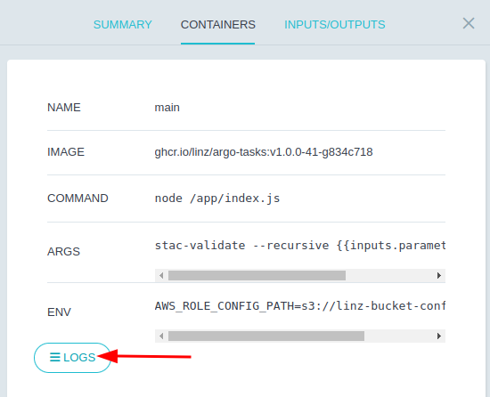

# stac-validate-parallel

This Workflow will validate each collection (and linked items/assets) in a separate pod so that multiple collections can be processed in parallel, using the `tpl-at-stac-validate` template.

## Workflow Outputs

If any schema validation failures are found, the workflow will fail.

Logs can be viewed in Argo by selecting the `stac-validate` workflow component > CONTAINERS > LOGS.



Example failure messages:

```json
{"level":30,"time":1668997179522,"pid":16,"hostname":"stac-validate-v1.0.0-41-n6jxb-stac-validate-971572670","id":"01GJBZQRM6D38WZWBDA91EJ8WR","type":"Feature","path":"s3://linz-imagery-staging/test/stac-validate/1259/272916_bad_field_type.json","sch":"https://stac.linz.govt.nz/v0.0.15/linz/schema.json","msg":"Validation:Start"}
{"level":50,"time":1668997179527,"pid":16,"hostname":"stac-validate-v1.0.0-41-n6jxb-stac-validate-971572670","id":"01GJBZQRM6D38WZWBDA91EJ8WR","path":"s3://linz-imagery-staging/test/stac-validate/1259/272916_bad_field_type.json","instancePath":"/properties/mission","schemaPath":"instrument.json/properties/mission/type","keyword":"type","params":{"type":"string"},"message":"must be string","msg":"Validation:Failed"}
{"level":50,"time":1668997179560,"pid":16,"hostname":"stac-validate-v1.0.0-41-n6jxb-stac-validate-971572670","id":"01GJBZQRM6D38WZWBDA91EJ8WR","failures":2,"msg":"StacValidation:Done:Failed"}
```

Example success messages:

```json
{"level":30,"time":1668995442613,"pid":16,"hostname":"stac-validate-v1.0.0-41-7mwdg-stac-validate-1503824974","id":"01GJBY2JNGWJHSKG71TXD9HCA2","type":"Feature","path":"s3://linz-imagery-staging/test/stac-validate/item2.json","sch":"https://stac.linz.govt.nz/v0.0.15/scanning/schema.json","msg":"Validation:Start"}
{"level":30,"time":1668995442614,"pid":16,"hostname":"stac-validate-v1.0.0-41-7mwdg-stac-validate-1503824974","id":"01GJBY2JNGWJHSKG71TXD9HCA2","type":"Feature","path":"s3://linz-imagery-staging/test/stac-validate/item2.json","valid":true,"msg":"Validation:Done:Ok"}
{"level":30,"time":1668995442614,"pid":16,"hostname":"stac-validate-v1.0.0-41-7mwdg-stac-validate-1503824974","id":"01GJBY2JNGWJHSKG71TXD9HCA2","msg":"StacValidation:Done:Ok"}
```
