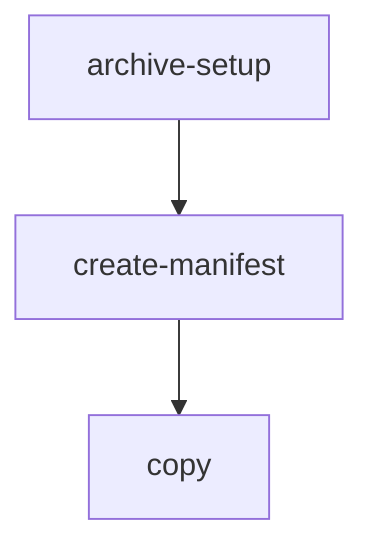
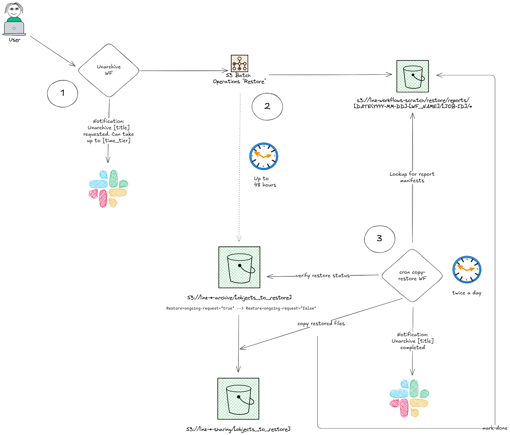
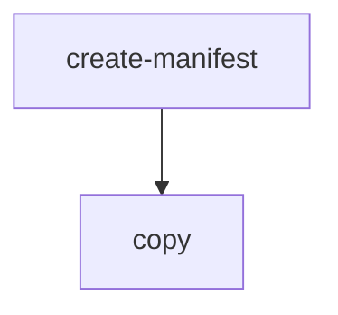

# Contents

- [Archive](#archive)
- [Copy](#copy)

## Archive

### Description

Archive files from a S3 location (for example `s3://linz-*-upload/[provider]/[survey]/[supply]/`) to a long term archive location (on a bucket where the files are stored as S3 Glacier Deep Archive storage class). This workflow is intended to be used after files in a source folder (for example, supplied by external provider) have been processed and not needed for any future update.

1. Verify the path of the files to archive. Restricted to some buckets only (TODO: link to `argo-task` command) and set the archive location.
1. Create a manifest of file to be archived from the source location (example: `s3://linz-topographic-upload/[PROVIDER]/[SURVEY]/`)
1. Compress each file listed in the manifest and check if the compression is worthwhile (very small files may have a bigger size after compression)
1. Copy the compressed (or original if smaller) file to the archive bucket (example: `s3://linz-topographic-archive/[PROVIDER]/[SURVEY]/`)
1. Ensure a new version is stored if a file already exists in the archive (this is managed by AWS S3 versioning)
1. Delete the original files that have been archived. The original files will be still available for retrieval for the next 90 days after deletion.

### Flow



This is a workflow that calls the `copy` workflow with `--compress` and `--delete-source` options, after setting up the archive location by calling the `archive-setup` workflow.

Access permissions are controlled by the [Bucket Sharing Config](https://github.com/linz/topo-aws-infrastructure/blob/master/src/stacks/bucket.sharing.ts) which gives Argo Workflows access to the S3 buckets we use.

### Workflow Input Parameters

| Parameter  | Type | Default | Description                                                                                                                 |
| ---------- | ---- | ------- | --------------------------------------------------------------------------------------------------------------------------- |
| user_group | enum | none    | Group of users running the workflow                                                                                         |
| ticket     | str  |         | Ticket ID e.g. 'AIP-55'                                                                                                     |
| source     | str  |         | The URI (path) to the s3 source location where the files to archive are.                                                    |
| group      | int  | 1000    | The maximum number of files for each pod to copy (will use the value of `group` or `group_size` that is reached first).     |
| group_size | str  | 100Gi   | The maximum group size of files for each pod to copy (will use the value of `group` or `group_size` that is reached first). |

## Unarchive

### Description

This workflow is used to restore s3 objects (_files_) in a directory that have been archived in an `archive` bucket. The S3 objects will be accessible in the corresponding `sharing` bucket.

**The `unarchive` workflow does not directly restore the S3 objects. It requests them to be restored.**

The entire process involves this workflow, S3 Batch Operations, and the `copy-restore` (name TBD) cron workflow.

### Process



1. The user submit an `unarchive` workflow specifying:

   - the archive bucket where the s3 objects (_files_) need to be restored from. Example: `linz-hydrographic-archive`
   - the path to the S3 objects within the archive bucket. Example: TODO
   - a title for the unarchive request. TBD with users
   - a retrieval tier. `BULK` for "normal" request, `STANDARD` for urgent requests.

   The workflow uses the `create-job` operation from `s3control` to request the restoration all objects under a specified prefix within an S3 archive bucket. It leverages the Manifest Generator to dynamically identify the objects to restore. It's a S3 Batch Operations "restore" job that is submitted by the system.

   The user gets notified on Slack that the unarchive request has been initiated.

2. The S3 Batch operations "restore" job initiates the restoration of the S3 objects that can take up to 48 hours for `BULK` tier. A job report is created in at the `s3://linz-workflows-scratch/restore/reports/[DATE(YYYY-MM-DD)]-[WF_NAME]/` location. A report is composed of:

- a `manifest.json` file that contains a list of results. Each result points to a CSV file.

  Example:

  ```json
  {
    "Format": "Report_CSV_20180820",
    "ReportCreationDate": "2025-07-20T21:18:22.395320681Z",
    "Results": [
      {
        "TaskExecutionStatus": "succeeded",
        "Bucket": "linz-workflows-scratch",
        "MD5Checksum": "d080c493d4d9e2f38699eae6f6766dc6",
        "Key": "restore/reports/2025-07-20-test-unarchive-6qvr8/job-f007df86-0678-4b59-8338-23f069063fe3/results/c59d4d695ca508d75409be035df5da263de49c28.csv"
      },
      {
        "TaskExecutionStatus": "failed",
        "Bucket": "linz-workflows-scratch",
        "MD5Checksum": "bfa50538eaccef8a659a28aff418bc21",
        "Key": "restore/reports/2025-07-20-test-unarchive-6qvr8/job-f007df86-0678-4b59-8338-23f069063fe3/results/068cef22bcd822a9f0ca1881bd4c247e4ac241b3.csv"
      }
    ],
    "ReportSchema": "Bucket, Key, VersionId, TaskStatus, ErrorCode, HTTPStatusCode, ResultMessage"
  }
  ```

  - the CSV files linked in the `manifest.json` containing the list of the S3 objects that have been requested to be restored. _Note: the schema of the CSV files is described in the `manifest.json` under `ReportSchema`._

    Example:

    ```csv
    linz-topographic-archive,pfouquet/sub/directory/AS21.tiff.zst,886twyul.uJ3wIF3zzQG8196hf_SOCCW,succeeded,200,,Successful
    ```

  Each object that has been requested to be restored is now "tagged" with `Restore=ongoing-request=true`. This value will change to `Restore=ongoing-request=false` and for the amount of time the restoration has been set for (TBD, 3 days on the current implementation), then this "tag" (TODO: change the name tag as it's not necessary a tag) will disappear.

  The user get notified via Slack that the unarchive process has started.

3. A cron workflow `copy-restore` (name TBD) runs twice a day to copy the restored S3 objects from the archive bucket to the sharing bucket. _Note: the following describes the `copy-restore` workflow and will be moved to its own section._

   a. Collect the `manifest.json` in `s3://linz-workflows-scratch/restore/reports/*`

   b. For each `manifest.json` Call `linz/argo-tasks/verify-restore` command to verify the restoration status. If the command is successful (failure if at least one object is not restored), one or several copy action manifest(s) will be output, and the `manifest.json` report will be renamed to `*.done` (default `--mark-done=true`).

   c. If the `verify-restore` tasks outputs one or several copy action manifest(s), a `copy` task will be initiated for each copy action manifest in order to copy the restored objects to the sharing location

   d. Once a group of `copy` tasks per `verify-restore` task is successful, the user will be notified on Slack that the restoration has been completed and a link to the sharing location will be provided.

## Copy

### Description

Copy files from one S3 location to another. This workflow is intended to be used after standardising and QA to copy:

- from `linz-workflows-scratch` "flattened" directory to `linz-imagery`
- from `linz-imagery-upload` to `linz-imagery-staging` to store a copy of the uploaded RGBI imagery.



This is a workflow that uses the [argo-tasks](https://github.com/linz/argo-tasks#create-manifest) container `create-manifest` (list of source and target file paths) and `copy` (the actual file copy) commands.

Access permissions are controlled by the [Bucket Sharing Config](https://github.com/linz/topo-aws-infrastructure/blob/master/src/stacks/bucket.sharing.ts) which gives Argo Workflows access to the S3 buckets we use.

### Workflow Input Parameters

| Parameter            | Type  | Default                                                                                                                                                       | Description                                                                                                                                                                                                                 |
| -------------------- | ----- | ------------------------------------------------------------------------------------------------------------------------------------------------------------- | --------------------------------------------------------------------------------------------------------------------------------------------------------------------------------------------------------------------------- |
| user_group           | enum  | none                                                                                                                                                          | Group of users running the workflow                                                                                                                                                                                         |
| ticket               | str   |                                                                                                                                                               | Ticket ID e.g. 'AIP-55'                                                                                                                                                                                                     |
| region               | enum  |                                                                                                                                                               | Region of the dataset                                                                                                                                                                                                       |
| source               | str   | s3://linz-imagery-staging/test/sample/                                                                                                                        | The URIs (paths) to the s3 source location. Separate multiple source paths with `;`                                                                                                                                         |
| target               | str   | s3://linz-imagery-staging/test/sample_target/                                                                                                                 | The URIs (paths) to the s3 target location                                                                                                                                                                                  |
| include              | regex | \\.tiff?\$\|\\.json\$\|\\.tfw\$\|/capture-area\\.geojson\$\|/capture-area\\.geojson\$                                                                         | A regular expression to match object path(s) or name(s) from within the source path to include in the copy.                                                                                                                 |
| exclude              | regex |                                                                                                                                                               | A regular expression to match object path(s) or name(s) from within the source path to exclude from the copy.                                                                                                               |
| copy_option          | enum  | --no-clobber                                                                                                                                                  | <dl><dt>`--no-clobber` </dt><dd> Skip overwriting existing files.</dd><dt> `--force` </dt><dd> Overwrite all files. </dd><dt> `--force-no-clobber` </dt><dd> Overwrite only changed files, skip unchanged files. </dd></dl> |
| flatten              | enum  | false                                                                                                                                                         | Flatten the files in the target location (useful for multiple source locations)                                                                                                                                             |
| group                | int   | 1000                                                                                                                                                          | The maximum number of files for each pod to copy (will use the value of `group` or `group_size` that is reached first).                                                                                                     |
| group_size           | str   | 100Gi                                                                                                                                                         | The maximum group size of files for each pod to copy (will use the value of `group` or `group_size` that is reached first).                                                                                                 |
| transform            | str   | `f`                                                                                                                                                           | String to be transformed from source to target to renamed filenames, e.g. `f.replace("text to replace", "new_text_to_use")`. Leave as `f` for no transformation.                                                            |
| aws_role_config_path | str   | `s3://linz-bucket-config/config-write.elevation.json,s3://linz-bucket-config/config-write.imagery.json,s3://linz-bucket-config/config-write.topographic.json` | s3 URL or comma-separated list of s3 URLs allowing the workflow to write to a target(s).                                                                                                                                    |

### Examples

#### Publish

**source:** `s3://linz-workflows-scratch/2022-11/15-imagery-standardising-v0.2.0-56-x7699/flat/`

**target:** `s3://linz-imagery/southland/invercargill_2022_0.1m/rgb/2193/`

**include:** Although only `.tiff` and `.json` files are required, there should not be any `.tfw` files in with the standardised imagery, so this option can be left at the default.

**copy_option:** `--no-clobber`

**Target path naming convention:** `s3://linz-imagery/<region>/<city-or-sub-region>_<year>_<resolution>/<product>/<crs>/`

#### Backup RGBI

**source:** `s3://linz-imagery-upload/Invercargill2022_Pgrm3016/OutputPGRM3016-InvercargillRural2022/tifs-RGBI/`

**target:** `s3://linz-imagery-staging/RGBi4/invercargill_urban_2022_0.1m/`

**include:** Although only `.tif(f)` and `.tfw` files are required, there should not be any `.json` files in with the uploaded imagery, so this option can be left at the default.

**copy_option:** `--no-clobber` |
