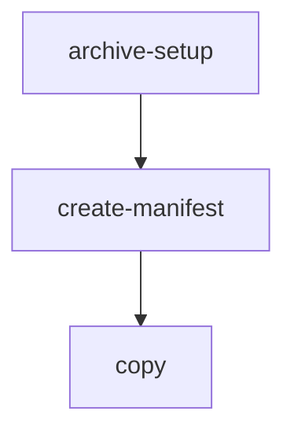
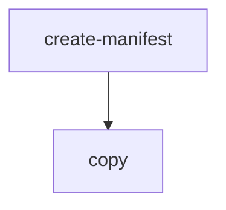

# Contents

- [Archive](#archive)
- [Copy](#copy)

## Archive

### Workflow Description

Archive files from a S3 location (for example `s3://linz-*-upload/[provider]/[survey]/[supply]/`) to a long term archive location (on a bucket where the files are stored as S3 Glacier Deep Archive storage class). This workflow is intended to be used after files in a source folder (for example, supplied by external provider) have been processed and not needed for any future update.

1. Verify the path of the files to archive. Restricted to some buckets only (TODO: link to `argo-task` command) and set the archive location.
1. Create a manifest of file to be archived from the source location (example: `s3://linz-topographic-upload/[PROVIDER]/[SURVEY]/`)
1. Compress each file listed in the manifest and check if the compression is worthwhile (very small files may have a bigger size after compression)
1. Copy the compressed (or original if smaller) file to the archive bucket (example: `s3://linz-topographic-archive/[PROVIDER]/[SURVEY]/`)
1. Ensure a new version is stored if a file already exists in the archive (this is managed by AWS S3 versioning)
1. Delete the original files that have been archived. The original files will be still available for retrieval for the next 90 days after deletion.

### Flow



This is a workflow that calls the `copy` workflow with `--compress` and `--delete-source` options, after setting up the archive location by calling the `archive-setup` workflow.

Access permissions are controlled by the [Bucket Sharing Config](https://github.com/linz/topo-aws-infrastructure/blob/master/src/stacks/bucket.sharing.ts) which gives Argo Workflows access to the S3 buckets we use.

### Workflow Input Parameters

| Parameter  | Type | Default | Description                                                                                                                 |
| ---------- | ---- | ------- | --------------------------------------------------------------------------------------------------------------------------- |
| user_group | enum | none    | Group of users running the workflow                                                                                         |
| ticket     | str  |         | Ticket ID e.g. 'AIP-55'                                                                                                     |
| source     | str  |         | The URI (path) to the s3 source location where the files to archive are.                                                    |
| group      | int  | 1000    | The maximum number of files for each pod to copy (will use the value of `group` or `group_size` that is reached first).     |
| group_size | str  | 100Gi   | The maximum group size of files for each pod to copy (will use the value of `group` or `group_size` that is reached first). |

## Copy

### Workflow Description

Copy files from one S3 location to another. This workflow is intended to be used after standardising and QA to copy:

- from `linz-workflows-scratch` "flattened" directory to `linz-imagery`
- from `linz-imagery-upload` to `linz-imagery-staging` to store a copy of the uploaded RGBI imagery.



This is a workflow that uses the [argo-tasks](https://github.com/linz/argo-tasks#create-manifest) container `create-manifest` (list of source and target file paths) and `copy` (the actual file copy) commands.

Access permissions are controlled by the [Bucket Sharing Config](https://github.com/linz/topo-aws-infrastructure/blob/master/src/stacks/bucket.sharing.ts) which gives Argo Workflows access to the S3 buckets we use.

Note: In order to mitigate stuck copy workflows the `tpl-copy` [template](https://github.com/linz/topo-workflows/blob/master/templates/argo-tasks/README.md#argo-taskscopy---tpl-copy) now times out after 15 minutes (using `activeDeadlineSeconds`) and will retry up to 10 times. This is a measure to avoid having to manually interact with the workflows while we investigate the root cause of this issue.

```yaml
activeDeadlineSeconds: '900' # Run up to 900 secs / 15 minutes
retryStrategy:
  limit: '10' # Retry up to 10 times
  retryPolicy: 'Always'
```

### Workflow Input Parameters

| Parameter            | Type  | Default                                                                                                                                                       | Description                                                                                                                                                                                                                 |
| -------------------- | ----- | ------------------------------------------------------------------------------------------------------------------------------------------------------------- | --------------------------------------------------------------------------------------------------------------------------------------------------------------------------------------------------------------------------- |
| user_group           | enum  | none                                                                                                                                                          | Group of users running the workflow                                                                                                                                                                                         |
| ticket               | str   |                                                                                                                                                               | Ticket ID e.g. 'AIP-55'                                                                                                                                                                                                     |
| region               | enum  |                                                                                                                                                               | Region of the dataset                                                                                                                                                                                                       |
| source               | str   | s3://linz-imagery-staging/test/sample/                                                                                                                        | The URIs (paths) to the s3 source location. Separate multiple source paths with `;`                                                                                                                                         |
| target               | str   | s3://linz-imagery-staging/test/sample_target/                                                                                                                 | The URIs (paths) to the s3 target location                                                                                                                                                                                  |
| include              | regex | \\.tiff?\$\|\\.json\$\|\\.tfw\$\|/capture-area\\.geojson\$\|/capture-area\\.geojson\$                                                                         | A regular expression to match object path(s) or name(s) from within the source path to include in the copy.                                                                                                                 |
| exclude              | regex |                                                                                                                                                               | A regular expression to match object path(s) or name(s) from within the source path to exclude from the copy.                                                                                                               |
| copy_option          | enum  | --no-clobber                                                                                                                                                  | <dl><dt>`--no-clobber` </dt><dd> Skip overwriting existing files.</dd><dt> `--force` </dt><dd> Overwrite all files. </dd><dt> `--force-no-clobber` </dt><dd> Overwrite only changed files, skip unchanged files. </dd></dl> |
| flatten              | enum  | false                                                                                                                                                         | Flatten the files in the target location (useful for multiple source locations)                                                                                                                                             |
| group                | int   | 1000                                                                                                                                                          | The maximum number of files for each pod to copy (will use the value of `group` or `group_size` that is reached first).                                                                                                     |
| group_size           | str   | 100Gi                                                                                                                                                         | The maximum group size of files for each pod to copy (will use the value of `group` or `group_size` that is reached first).                                                                                                 |
| transform            | str   | `f`                                                                                                                                                           | String to be transformed from source to target to renamed filenames, e.g. `f.replace("text to replace", "new_text_to_use")`. Leave as `f` for no transformation.                                                            |
| aws_role_config_path | str   | `s3://linz-bucket-config/config-write.elevation.json,s3://linz-bucket-config/config-write.imagery.json,s3://linz-bucket-config/config-write.topographic.json` | s3 URL or comma-separated list of s3 URLs allowing the workflow to write to a target(s).                                                                                                                                    |

### Examples

#### Publish

**source:** `s3://linz-workflows-scratch/2022-11/15-imagery-standardising-v0.2.0-56-x7699/flat/`

**target:** `s3://linz-imagery/southland/invercargill_2022_0.1m/rgb/2193/`

**include:** Although only `.tiff` and `.json` files are required, there should not be any `.tfw` files in with the standardised imagery, so this option can be left at the default.

**copy_option:** `--no-clobber`

**Target path naming convention:** `s3://linz-imagery/<region>/<city-or-sub-region>_<year>_<resolution>/<product>/<crs>/`

#### Backup RGBI

**source:** `s3://linz-imagery-upload/Invercargill2022_Pgrm3016/OutputPGRM3016-InvercargillRural2022/tifs-RGBI/`

**target:** `s3://linz-imagery-staging/RGBi4/invercargill_urban_2022_0.1m/`

**include:** Although only `.tif(f)` and `.tfw` files are required, there should not be any `.json` files in with the uploaded imagery, so this option can be left at the default.

**copy_option:** `--no-clobber` |
