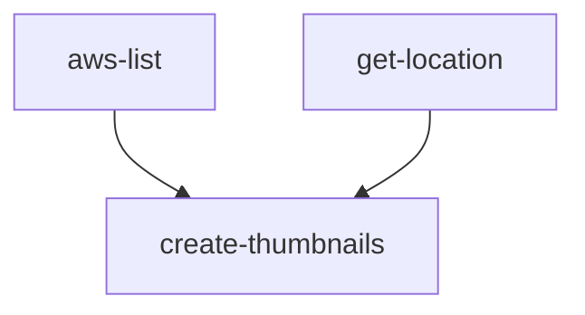

# Contents:

- [create-thumbnails](#Create-Thumbnails)

# Create-Thumbnails

This workflow generates thumbnails for the topo50 and topo250 GeoTiffs and TIFF.
The thumbnails are used on the LINZ website at the [Topo50](https://www.linz.govt.nz/products-services/maps/new-zealand-topographic-maps/topo50-map-chooser) and [Topo250](https://www.linz.govt.nz/products-services/maps/new-zealand-topographic-maps/topo250-map-chooser) Map Chooser Pages.

Thumbnailing uses two gdal_translate steps.
Upon completion all standardised TIFF and STAC files will be located within the `./intermediate/` directory of the workflow in the artifacts bucket. From here the thumbnails can be moved to `s3://linz-topographic` using the publish-copy workflow.

## Workflow Input Parameters

| Parameter   | Type | Default                           | Description                                                                                                                                                      |
| ----------- | ---- | --------------------------------- | ---------------------------------------------------------------------------------------------------------------------------------------------------------------- |
| source      | str  | s3://linz-topgraphic/maps/topo50/ | the uri (path) to the input tiffs                                                                                                                                |
| target      | str  | s3://linz-                        | the target uri (path) to copy the input and thumbnails                                                                                                           |
| transform   | str  | f                                 | String to be transformed from source to target to renamed filenames, e.g. `f.replace("text to replace", "new_text_to_use")`. Leave as `f` for no transformation. |
| copy-option | str  | no-clobber                        | `--no-clobber` Skip overwriting existing files. `--force` Overwrite all files. `--force-no-clobber` Overwrite only changed files, skip unchanged files. tiffs    |

## Workflow Outputs

The output thumbnails will be located within the `./intermediate/` directory of the workflow in the artifacts bucket.

## Workflow Description

### [aws-list](https://github.com/linz/argo-tasks/blob/master/src/commands/list/list.ts)

Recursively loops through the provided source path and lists all the files within this location. Some listing parameters are currently hard-coded due to the current bespoke purpose of this workflow:

- group: `"2000"`
- include: `".*.*.tif?$"`

### [get-location](./standardising.yaml)

Finds the output location of this workflow within the artifacts bucket.

### [create-thumbnails](https://github.com/linz/topo-imagery/blob/master/scripts/thumbnails.py)

Runs the bespoke gdal_translate commands to generate thumbnails of the topo50 & topo250 Maps.
